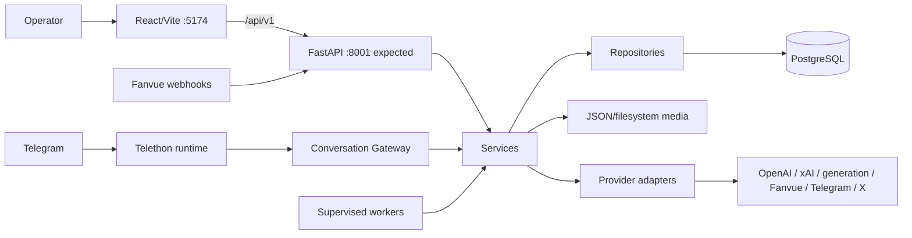
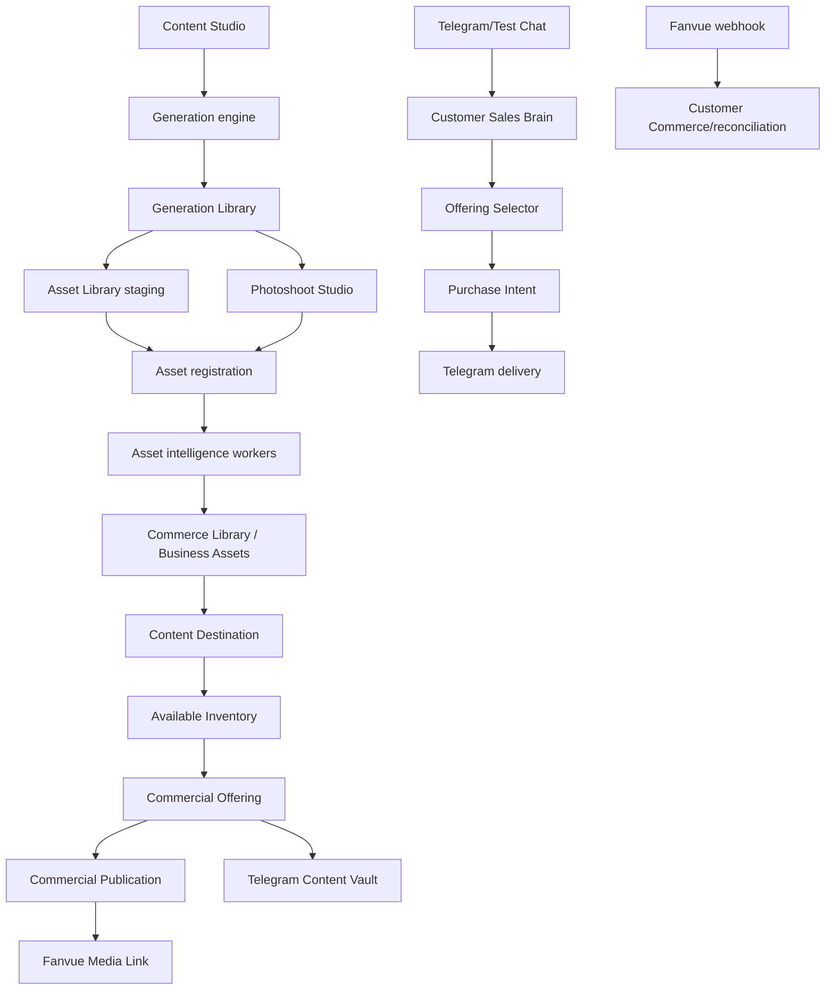
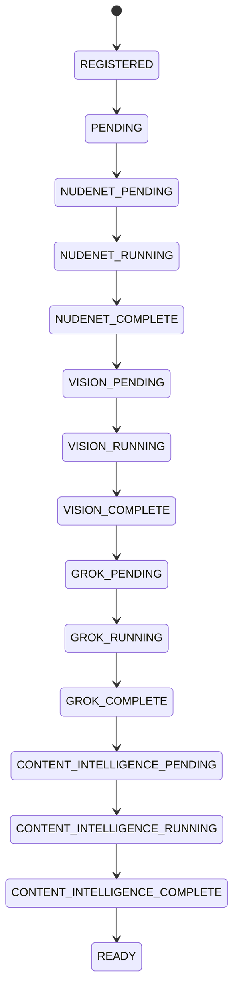
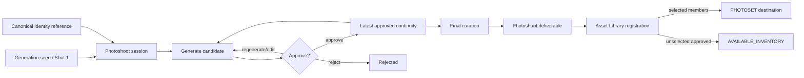
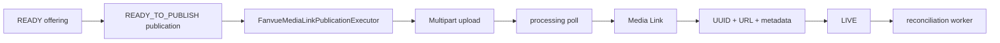
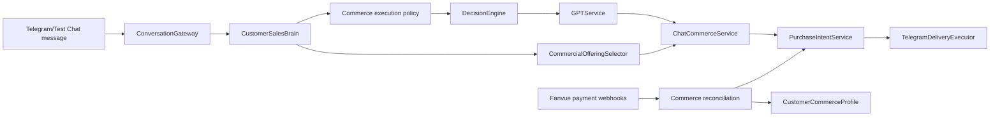

# System architecture

## Runtime

- **Frontend:** React 19, React Router 7, TypeScript, Vite 6; entry routing in `frontend/src/app/router/router.tsx`.
- **Backend:** FastAPI application `app.fanvue_callback_server:app`; routers under `app/api/`.
- **Persistence:** PostgreSQL through repository modules and `DATABASE_URL`; JSON/filesystem stores remain for generation, creative sessions, archives, and social publishing.
- **Migrations:** ordered SQL in `migrations/forward`, corresponding recovery scripts in `migrations/rollback`, managed by `SchemaManagerService`.
- **Workers:** Python modules under `app/workers`, opt-in and supervised by `WorkerLauncherSupervisionService`; heartbeats persist health.
- **Media:** local vault/media files are streamed by API media endpoints; Vite also contains a legacy development-only generation-library adapter.

## Major components

## Asset registration

Each provider stage has a FAILED state. Orchestration maps completion to the next pending state. Evidence: `app/models/asset_intelligence.py`, `app/services/business_asset_analysis_orchestrator.py`, worker/repository pairs named for each stage.

## Photoshoot workflow

Evidence: `app/api/photoshoot.py`, `app/services/photoshoot_curation_service.py`, `app/services/photoshoot_*`, migrations `20260721_*`.

## Commercial publication

The Telegram Content Vault is a separate marketing publication event and reuses the authoritative active Media Link; it is not the provider-backed `CommercialPublication`. Evidence: `app/services/fanvue_media_link_publication_executor.py`, `commerce_telegram_vault_service.py`, `social_publishing_service.py`.

## Autonomous conversation/sales

`CustomerSalesBrainService` authorizes commerce; relationship, intent, safety, personality, and response generation remain in the Conversation Brain. Evidence: `app/services/conversation_gateway.py`, `customer_sales_brain_service.py`, `commerce_execution_policy.py`, `commercial_offering_selector_service.py`, `telegram_inbound_adapter.py`.

## Repository boundaries

`C:\Creator-OS-React` contains the current React UI and FastAPI runtime, plus legacy Streamlit modules retained under `app/dashboard`. `C:\Creator-OS` is historical only. X publishing adapter code is in this repository, but broader X automation belongs to the separate `C:\X_Auto` project and was not audited as part of this system.

