# Content lifecycle

```mermaid
flowchart LR
  G[Generation] --> S[Staged]
  S --> R[Registered Asset]
  R --> A[Automated analysis]
  A --> Ready[READY]
  Ready --> D[Content Destination]
  D --> I[Available Inventory]
  I --> O[Commercial Offering]
  O --> P[Publication]
  P --> Sale[Sale/payment signal]
  Sale --> Del[Delivery/fulfillment]
  Del --> Arc[Archive/history]
```

| Transition | Initiator | Automatic? | Page/status | Failure/recovery |
|---|---|---|---|---|
| Prompt → generation | Operator in Content Studio | Provider job/poll automatic after click | Live Generation | Check provider key, job error, backend logs; retry deliberately. |
| Generation → staging | “Move to Asset Library” | No | Generation/Asset Library | Move back is supported; missing file prevents useful preview. |
| Staging → registered | “Register Asset” | No | Asset Library | Validation/API error remains staged; retry after fixing source. |
| Registered → READY | Orchestrator/workers | Yes only when enabled | Commerce Library analysis state | Failed stage is persisted; stale leases recover; rerun worker after cause fixed. |
| READY → destination | Registration/default or curation | Mixed | Commerce Library/Photoshoot | AVAILABLE_INVENTORY is default; committed destinations enforce rules. |
| Inventory → offering | Operator in Commerce | No | Commerce authoring | Eligibility, ownership, type, hero, price/channel validation. |
| Offering → publication record | Operator | No | Commerce detail | Requires READY offering/channel; duplicate provider publication rejected. |
| Publication → LIVE | Explicit execute/worker | Guarded automation | Publication status | Check OAuth/scopes/media; checkpoints and retry/reconcile prevent blind duplication. |
| Offer → Purchase Intent | Chat commerce before delivery | Automatic | Developer Purchase Intents | New active intent supersedes previous; failed send becomes abandoned. |
| Payment → customer profile | Public verified webhook + reconciliation | Automatic if runtime active | Customer Commerce | Dedupe by provider event/transaction; ambiguous attribution remains UNKNOWN. |
| Sale → delivery | Chat/fulfillment service | Constrained | operations/fulfillment | Exactly-once acknowledgement and URL validation are required; operator observes failures. |

## Destination rules

`ContentDestination` values are `AVAILABLE_INVENTORY`, `PHOTOSET`, `VIDEOSET`, `STORY_SET`, `TELEGRAM_WALL`, `TEASER`, `SINGLE_PPV`, and `BUNDLE`. One row per canonical Asset is enforced structurally, with history. AVAILABLE_INVENTORY means analyzed and commercially uncommitted; it is not a second Asset store. Destination is not registration, readiness, publication, or service status.

Photoshoot curation commits selected approved members to a `PHOTOSET`; approved but unselected members can remain AVAILABLE_INVENTORY. Committed destinations such as PHOTOSET and TELEGRAM_WALL are treated as immutable by service rules, preventing accidental reuse. Evidence: `app/models/content_destination.py`, `content_destination_service.py`, `photoshoot_curation_service.py`.

## Photoshoot lifecycle

1. Start from a Generation Library seed; seed is Shot 1.
2. The active canonical reference preserves identity; latest approved candidate preserves session continuity.
3. Generate candidate; approve, regenerate, edit prompt, or reject.
4. Finish and open curation. Approved assets are selected by default and the seed is mandatory.
5. Confirm curation: selected membership becomes the immutable photoset deliverable/destination; unselected approved assets remain available.
6. Add/register the typed deliverable through Asset Library, then analysis/readiness proceeds.

Evidence: `app/api/photoshoot.py`, `PhotoshootCurationPanel.tsx`, `photoshoot_curation_service.py`, migrations `20260721_001`–`009`.

