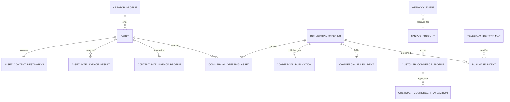

# API and data reference

See [route catalog](14-route-catalog.md) for endpoints.

## Core data map

## Important states and constraints

- Asset intelligence states are enumerated in `app/models/asset_intelligence.py`; worker job tables use leases, attempts, next-attempt/error fields.
- `asset_content_destinations` has one authoritative active row per asset and history records every change (`20260723_001`).
- Offer types: SINGLE_IMAGE, PHOTOSET, VIDEO, STORY, STORY_SET, BUNDLE. Authoring currently supports the first three. Status: DRAFT, READY, ARCHIVED.
- Primary channels: AI_CHAT and TELEGRAM_WALL.
- Publication provider currently FANVUE. Status: DRAFT, READY_TO_PUBLISH, PUBLISHING, LIVE, FAILED, ARCHIVED; duplicate provider publication is prevented.
- PurchaseIntent: CREATED, PRESENTED, CLICKED, PURCHASED, EXPIRED, ABANDONED, UNKNOWN, SUPERSEDED. At most one active intent per buyer is enforced transactionally.
- Customer commerce transactions are idempotent by provider transaction identity; profile totals derive from verified records.
- `webhook_events.external_event_id` is unique after launch hardening.

Evidence: models under `app/models`, migrations `20260723_001`–`20260725_009`, matching repositories.

## Active, foundation, and legacy storage

Actively used: canonical assets/intelligence jobs/profiles, destination/history, photoshoot deliverables, offerings/assets, publications/uploads, fulfillments, Fanvue accounts/tokens, Telegram identities, webhook events, customer commerce transactions/profiles, purchase intents, worker heartbeats.

Foundation/limited UI: story/story-set and bundle enum support, broader product intelligence/optimization models, some opportunity/recommendation models.

Legacy/compatibility: Product/catalog and older commerce destination/registration concepts coexist with Commercial Offerings/Content Destination; JSON files remain for generation library, creative sessions, archives, and social publishing. Do not join or mutate destination tables directly; use `ContentDestinationService`.

## Representative request traces

**Register:** `AssetLibraryPage` → `POST /assets/staged/{id}/register` → `AssetLibraryService` → Asset/analysis repositories → analysis jobs → worker pipeline → READY.

**Offer:** `CommercePage` → `POST /commerce-authoring` → `CommerceAuthoringService` → offering/destination repositories → offering + membership.

**Fanvue:** publication execute API → `CommercialPublicationService` → `FanvueMediaLinkPublicationExecutor` → `FanvueOfficialClient` → provider IDs → publication repository.

**Chat:** Telethon/TestChat → ConversationGateway → CustomerSalesBrain/selector → DecisionEngine/GPT → ChatCommerce → PurchaseIntent → Telegram delivery.

## Data risks

The dual JSON/PostgreSQL storage model can create visibility mismatches. Some lifecycle rules are service-enforced rather than database-enforced. Compatibility Product and destination models duplicate vocabulary. Direct repository access can bypass domain rules. Periodic orphan/constraint audits should cover offering members, local media, publications without offerings, and job rows without Assets.

