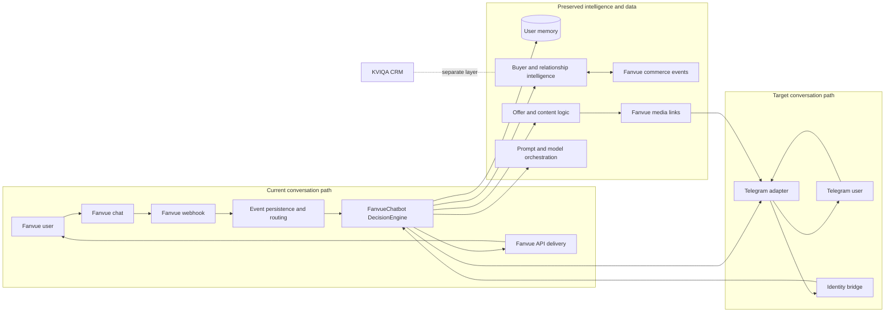
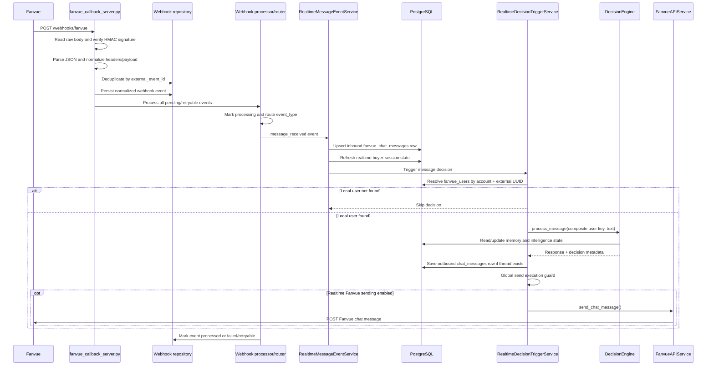
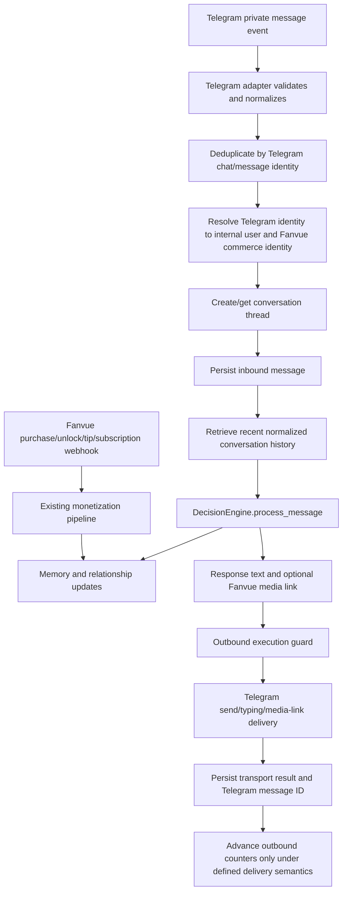
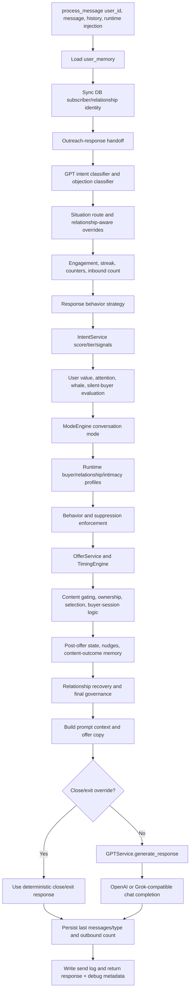
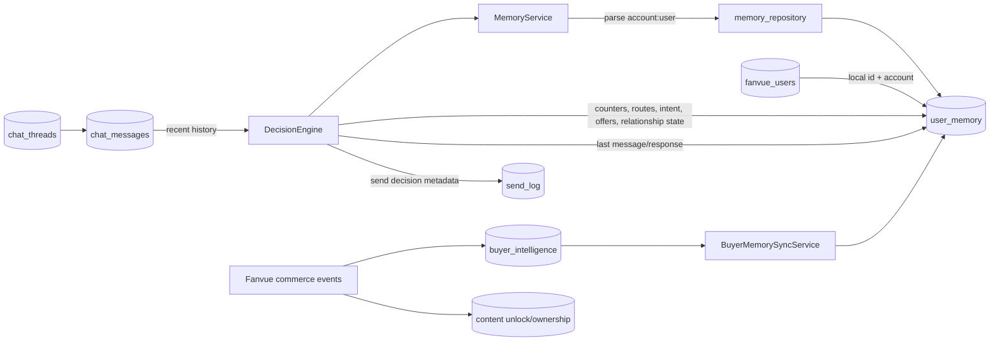

# FanvueChatbot Telegram Migration Architecture Audit

## 1. Executive Summary

The migration should preserve FanvueChatbot as the intelligence and orchestration application and replace only its conversational transport boundary. Telegram should become the conversation layer; Fanvue should remain the commerce, checkout, media-hosting, media-link, purchase-event, and ownership source; KVIQA remains an external CRM layer and KVIQ Bot is outside scope.

The repository already has a strong central intelligence entry point: `DecisionEngine.process_message()` in `app/engine/decision_engine.py`. It owns routing, intent, user-value evaluation, relationship shaping, emotional and intimacy safeguards, offer selection, content selection, response generation, and memory updates. Most of this is reusable without behavioral redesign.

The transport boundary is not yet cleanly isolated. The live message path is spread across the Fanvue webhook server, event persistence and routing, realtime message storage, Fanvue user lookup, chat persistence, the DecisionEngine call, send guards, and `FanvueAPIService`. Fanvue terminology and identifiers also appear throughout otherwise reusable repositories and services. Migration therefore requires an adapter plus an identity bridge, not merely a new listener.

The separate `C:\Telegram Chatbot` repository demonstrates a workable Telethon session and private-message listener flow. It must remain reference-only. Its own database, funnel logic, emotional engine, CTA logic, timing engine, and GPT prompt path duplicate FanvueChatbot responsibilities and must not be imported into the target application.

The highest-risk concern is identity continuity. Current memory is addressed by the composite key `fanvue_account_id:local_fanvue_user_id`, and live decisions require a matching row in `fanvue_users`. A Telegram user cannot safely reach the existing memory, buyer, ownership, and purchase systems until a stable Telegram-to-internal-user-to-Fanvue-commerce identity mapping is defined.

Overall estimated migration difficulty: **High (7.5/10)**. Telegram receiving and sending are straightforward; preserving memory, commerce attribution, safety behavior, ordering, and delivery semantics across the platform boundary is the difficult part.

## 2. Architecture Overview

### 2.1 Application layers

| Layer | Current implementation | Migration disposition |
|---|---|---|
| Runtime/UI | `start.py`, FastAPI callback server, Streamlit dashboard, workers | Preserve; add Telegram runtime composition later |
| Conversation ingestion | Fanvue webhook endpoint, signature verification, event normalization/persistence/routing | Replace for Telegram messages; retain Fanvue monetization webhooks |
| Identity | `fanvue_accounts`, `fanvue_users`, composite engine key | Extend with a transport-neutral identity bridge |
| Conversation persistence | `fanvue_chat_messages`, `chat_threads`, `chat_messages` | Reuse conceptually; remove Fanvue-only assumptions at adapter boundary |
| Intelligence | `DecisionEngine`, mode, intent, routing, user value, offer/content/timing services | Preserve |
| Relationship intelligence | Buyer, intimacy, emotional continuity, whale protection, recovery, dependency safeguards | Preserve |
| Memory | `MemoryService`, `memory_repository`, `user_memory`, buyer-memory synchronization | Preserve data and behavior; adapt identity lookup |
| Response generation | Creator profile, personas, GPT classifier, behavior context, OpenAI/Grok selection | Preserve |
| Delivery | `FanvueAPIService`, send/content guards, delivery logs | Replace chat delivery with Telegram adapter; retain commerce/media APIs |
| Commerce | Fanvue media links, uploads, vault, purchases, unlocks, tips, subscriptions, ownership | Preserve |
| CRM | KVIQA | Preserve as separate CRM; no KVIQ Bot migration |

### 2.2 System diagram



### 2.3 Repository organization

- `app/engine`: central DecisionEngine plus simpler mode/conversation engines.
- `app/services`: orchestration, intelligence, Fanvue API integration, delivery, workers, and safety services.
- `app/repositories`: PostgreSQL persistence for accounts, users, memory, messages, buyer intelligence, ownership, events, content, queues, campaigns, and logs.
- `app/dashboard`: operational Streamlit UI.
- `app/personas` and creator-profile persistence: persona and account-scoped prompt inputs.
- `data`: content catalog, creator/behavior configuration, uploads, previews, and local artifacts.
- `app/test_*.py`: extensive behavior-level tests that can serve as preservation regression coverage.

### 2.4 Telegram reference architecture

The reference repository is a small asynchronous Telethon application:

```text
login_amanda.py
  -> TelegramClient user-session login
  -> tg_sessions/amanda.session

listener_amanda.py
  -> Telethon NewMessage(incoming=True)
  -> private/text-message filtering
  -> sender.id identity
  -> Telegram-specific PostgreSQL user/message updates
  -> local logic.py/timing.py/gpt.py
  -> typing action
  -> event.respond(reply)
  -> outbound logging and next-reply scheduling
```

Useful reference behavior is limited to Telethon authentication/session persistence, private-message listeners, `sender.id`, typing actions, `event.respond`, and disconnect lifecycle. The repository contains no implemented `send_file`/media-delivery flow. It also mixes bot-token configuration with a user-session Telethon listener, and `listener_amanda.py` imports `TG_API_ID`/`TG_API_HASH` that the inspected `config.py` does not expose. It is therefore not a production-ready dependency.

## 3. Message Flow Diagram

### 3.1 Current live Fanvue inbound message flow



### 3.2 Entry points, queues, and routing

| Stage | File(s) | Responsibility |
|---|---|---|
| Server startup | `start.py` | Starts the Fanvue callback server and Streamlit dashboard |
| HTTP ingestion | `app/fanvue_callback_server.py` | OAuth callback and `/webhooks/fanvue` endpoint |
| Authentication | `app/services/webhook_signature_service.py` | Verifies Fanvue webhook signature |
| Normalization | `app/services/webhook_normalizer_service.py` | Extracts event type, event ID, account ID, user ID, payload, headers |
| Durable event queue | `app/repositories/webhook_event_repository.py` | Deduplication, persistence, processing state, retryable failures |
| Queue processor | `app/services/webhook_event_processor_service.py` | Fetches pending events and marks processing/processed/failed |
| Event router | `app/services/webhook_event_router_service.py` | Routes message versus monetization event types |
| Message intake | `app/services/realtime_message_event_service.py` | Stores inbound record, refreshes buyer session, triggers decision |
| Decision bridge | `app/services/realtime_decision_trigger_service.py` | Resolves user, calls DecisionEngine, persists response, executes send guard |
| Delivery | `app/services/fanvue_api_service.py` | Sends Fanvue chat message through the Fanvue API |

The “queue” is a database-backed webhook-event state machine processed synchronously from the webhook request, with a processor method capable of handling pending/retryable rows. Separate delayed-message, outreach, mass-PPV, reaction, and wall-post queues/workers exist for proactive behavior, but they are not the primary inbound chat path.

### 3.3 Monetization event flow that must remain

Fanvue webhook events for purchase, unlock, tip, subscription creation, and subscription cancellation are routed to `RealtimeMonetizationEventService`. That service normalizes/persists the monetization event, updates buyer statistics and tiers, records ownership/unlocks, synchronizes buyer intelligence into `user_memory`, reinforces intimacy state, makes post-purchase decisions, applies reaction safety/duplicate/cooldown/buyer-session guards, and may schedule or execute acknowledgments and follow-ups.

This is not conversation transport and should not be removed. In the target design it becomes the Fanvue commerce feedback path that updates the same user memory used by Telegram conversations.

### 3.4 Target message flow



## 4. Decision Engine Diagram

### 4.1 Decision ownership

`app/engine/decision_engine.py::DecisionEngine.process_message()` is the authoritative conversation brain. `app/main.py` constructs a singleton with memory, intent, user-value, mode, offer, content, post-offer, timing, GPT, settings, and logger dependencies. `RealtimeDecisionTriggerService` imports this singleton and calls it for live messages.

The Telegram adapter should call this same engine boundary. It should not call the reference repository's `logic.py`, `timing.py`, or `gpt.py`.

### 4.2 Execution flow



### 4.3 Major service groups

| Group | Representative services | Responsibility |
|---|---|---|
| Classification/routing | `gpt_intent_classifier_service`, `intent_service`, `situation_routing_service`, `objection_classifier_service` | Interpret message, score intent, choose chat/sales/support/custom routes |
| Value and engagement | `user_value_service`, `engagement_service`, `silent_buyer_service`, `buyer_tier_service`, `buyer_momentum_service` | Allocate attention and estimate buyer state/value |
| Offer/content | `offer_service`, `content_service`, `content_gating_service`, `content_ownership_service`, `post_offer_service`, `timing_engine` | Decide whether/what/when to offer and avoid reselling owned content |
| Buyer session | `hot_buyer_detection_service`, `buyer_session_service`, realtime buyer refresh services | Manage high-intent multi-step conversion sessions |
| Intimacy | eligibility, profile, context, routing, memory, safety, cooldown, dynamic/escalation/runtime services | Shape escalation while enforcing eligibility and safety |
| Premium/whale | whale protection/retention/burnout and premium relationship/continuity services | Protect valuable relationships and control monetization fatigue |
| Emotional/relationship | emotional presence/continuity/dependency/stability, recovery, advanced governance, final relationship intelligence | Maintain emotional continuity and apply final behavioral safeguards |
| Runtime safety | global automation/send guards, runtime behavior/suppression/compatibility | Block unsafe or disabled execution and reconcile conflicting signals |

### 4.4 Response generation pipeline

1. DecisionEngine assembles `working_memory_after_offer`, including route, intent, engagement, buyer session, relationship, runtime, safety, ownership, creator profile, and optional offer/content link.
2. `OfferService.build_offer_copy()` prepares commercial copy when an offer is eligible.
3. `GPTService.generate_response()` requires an account-scoped creator profile, builds persona instructions, injects chat history, memory, ownership, intimacy, dependency, relationship, effort, behavior, and offer context.
4. Provider selection is computed in DecisionEngine and honored by GPTService through OpenAI-compatible clients for OpenAI or Grok.
5. Close/exit buyer-session states can override normal model generation with controlled responses.
6. DecisionEngine stores last inbound/outbound text and message type, increments outbound memory, writes a send-log record, and returns a rich decision object.
7. The realtime trigger, not DecisionEngine, owns actual transport delivery.

## 5. Memory System Overview

### 5.1 Identity model

| Identifier | Role |
|---|---|
| `fanvue_accounts.id` | Local creator/account primary key and tenant boundary |
| `fanvue_users.id` | Local user primary key used by repositories and memory |
| `fanvue_users.fanvue_user_uuid` | External Fanvue user identity, unique within account |
| Engine `user_id` | String composite: `fanvue_account_id:fanvue_users.id` |
| `user_memory.fanvue_account_id` + `fanvue_user_id` | Memory lookup key; user ID is stored/compared as text |
| `chat_threads.id` | Local conversation thread identity |
| `chat_threads.fanvue_chat_uuid` | Optional external Fanvue conversation identity |
| `chat_messages.fanvue_message_uuid` | Optional external Fanvue message identity |

`get_or_create_user_with_memory()` creates the `fanvue_users` row and matching `user_memory` row. A user can have one locally selected chat thread per account in the current repository method. Recent thread messages are formatted as OpenAI-style `user`/`assistant` history.

### 5.2 Memory architecture diagram



### 5.3 Memory categories

- Conversation state: inbound/outbound/message counts, last messages, mode, timestamps, route history.
- Intent and engagement: scores, signals, pricing/exclusive/closing counters, streak, depth, tier.
- Identity/relationship: subscriber/follower status, relationship status, subscriber profile, persona.
- Monetization: buyer tier, PPV activity, spend, offers, price resistance, discounts, silent-buyer state.
- Content learning: seen/favorite tags and types, intensity preference, outcomes, ownership context.
- Offer lifecycle: last offer, offer state, messages since offer, nudges, cooldown-related state.
- Outreach and buyer sessions: attempts/responses and multi-step buyer-session state.
- Separate intelligence stores: buyer intelligence, content ownership/unlocks, monetization events, reactions, queues, and message history feed runtime memory.

### 5.4 Read path

1. Transport resolves an external identity to local account/user IDs.
2. It constructs the composite engine key.
3. DecisionEngine calls `MemoryService.get_user_memory()`.
4. MemoryService parses the key and calls `get_user_memory_row()`.
5. DecisionEngine enriches that row with current user-record, creator-profile, buyer, ownership, runtime, and chat-history context.

### 5.5 Write path and triggers

- Every inbound decision increments message/inbound counts and timestamps.
- Classification and routing update route, intent, engagement, subscriber, and behavior-related fields.
- Offer/content decisions update offer state, selected tags, prices, seen content, outcomes, and buyer-session state.
- Response completion writes the last user message, last bot response, last message type, and outbound count.
- Fanvue purchase/unlock/tip/subscription events update buyer intelligence and synchronize summarized buyer state back into `user_memory`.
- Outreach, delayed follow-ups, reactions, and post-purchase pipelines update memory independently of inbound chat.

### 5.6 Memory migration implications

The memory contents are reusable, but their addressing is Fanvue-named and local-user dependent. Telegram identity should map to the existing local user instead of creating an unrelated second intelligence profile. Conversation history must use normalized transport IDs while preserving existing `user`/`assistant` retrieval semantics. Commerce events must resolve to the same local user used by Telegram, or buyer and ownership intelligence will fragment.

## 6. Fanvue Dependency Map

Coupling classifications describe migration impact, not whether a component should be deleted. Commerce-specific Fanvue components remain valid in the target architecture.

### 6.1 High coupling

| Path/component | Responsibility | Migration complexity |
|---|---|---|
| `app/fanvue_callback_server.py` | Fanvue OAuth callback and signed webhook ingestion | High for chat ingestion; retain commerce callbacks/webhooks |
| `app/services/webhook_*` and `app/repositories/webhook_event_repository.py` | Fanvue signature, payload normalization, durable event routing | High; split conversation events from retained commerce events |
| `app/services/realtime_message_event_service.py` | Fanvue message extraction, inbound Fanvue record, trigger | High; replace with Telegram-normalized intake |
| `app/services/realtime_decision_trigger_service.py` | Fanvue-user lookup, composite key, thread persistence, DecisionEngine call, Fanvue send | High; primary adapter seam but currently mixes five concerns |
| `app/services/fanvue_api_service.py` | Fanvue chat, media, wall, insight, and vault API | High; replace chat-send use only, preserve commerce/media operations |
| `app/services/fanvue_message_sync_service.py`, `app/repositories/fanvue_message_sync_repository.py`, `app/repositories/fanvue_message_repository.py` | Fanvue polling/synchronization and message storage | High; obsolete for Telegram chat, potentially retain for audit/history |
| `app/services/fanvue_outbound_reaction_service.py` | Sends event-driven reactions through Fanvue | High; reactions intended for conversation must gain Telegram delivery |
| `app/services/fanvue_media_upload_service.py` | Fanvue upload/vault/paid-message operations | High but retained as commerce/media hosting; paid chat delivery semantics need separation |
| `app/repositories/user_repository.py`, `memory_repository.py`, `chat_message_repository.py` | Core identity, memory, and conversation persistence with Fanvue columns | High due to pervasive naming and key assumptions; avoid wholesale rewrite |
| `app/services/realtime_monetization_event_service.py` | Fanvue commerce feedback into intelligence and reactions | High and must be preserved; identity correlation is critical |

### 6.2 Medium coupling

| Path/component | Responsibility | Migration complexity |
|---|---|---|
| `app/main.py` | Composition root and CLI simulator uses Fanvue account/user setup | Medium; preserve service graph, add a transport-neutral composition path later |
| `app/services/memory_service.py` | Stable API but parses Fanvue-shaped composite ID | Medium; can be preserved behind identity mapping initially |
| `app/engine/decision_engine.py` | Core brain, but parses composite IDs and writes Fanvue-named log fields | Medium-to-high; preserve behavior and isolate rather than rewrite |
| `app/services/gpt_service.py` | Uses `fanvue_user_id` for intimacy context and `fanvue_link` for offers | Medium; semantic commerce fields remain useful, identity access should be normalized |
| `app/services/content_*`, `cms_fanvue_*`, `content_ownership_*` | Selects and tracks Fanvue-hosted content | Medium; keep commerce link/media metadata, change only delivery representation |
| `app/services/fanvue_relationship_sync_*`, `fan_insights_sync_service.py` | Synchronizes Fanvue subscription/follower/spend state | Medium and retained as commerce/relationship enrichment |
| `app/repositories/fanvue_account_repository.py`, `fanvue_user_repository.py` | Fanvue creator/fan persistence and OAuth | Medium; retain Fanvue commerce identities, add Telegram mapping alongside them |
| `app/services/one_on_one_ppv_send_service.py`, mass-PPV/outreach send services | Monetization targeting plus Fanvue execution | Medium-to-high; intelligence is reusable, execution channel is not |
| `app/dashboard/pages/fanvue_auth.py` | Fanvue OAuth administration | Medium but retained for commerce connectivity |

### 6.3 Low coupling / reusable core

| Path/component | Responsibility | Migration complexity |
|---|---|---|
| Intent, situation-routing, mode, behavior, objection services | Message understanding and response strategy | Low |
| User-value, engagement, silent-buyer, buyer-session logic | Intelligence based on normalized memory | Low-to-medium |
| Offer, timing, post-offer, content scoring/gating | Sales decisions | Low-to-medium; retain Fanvue-link output |
| Emotional, relationship, continuity, intimacy, whale, dependency services | Relationship behavior and safeguards | Low |
| Persona files and creator-profile system | Voice and prompt identity | Low |
| Global execution/safety guards | Outbound safety policy | Low; reuse before Telegram send |
| GPT/OpenAI/Grok orchestration | Response generation | Low |

## 7. Telegram Integration Recommendations

These are architecture recommendations only; no Telegram functionality is implemented by this audit.

### 7.1 Recommended adapter boundaries

1. **Telegram runtime adapter:** own Telethon client/session lifecycle, authentication mode, private-message filtering, event normalization, and graceful reconnect/disconnect.
2. **Inbound message adapter:** convert Telegram events to a transport-neutral envelope containing platform, account/persona, external user ID, chat ID, message ID, text, timestamp, and media metadata.
3. **Identity bridge:** resolve `(platform, external_account, external_user)` to the existing internal account/user and optional Fanvue commerce UUID. This is the prerequisite for memory continuity.
4. **Conversation repository boundary:** create/retrieve a normalized thread, deduplicate the external message, save inbound content, and retrieve recent history in the existing role/content format.
5. **Brain facade:** keep a narrow call around `DecisionEngine.process_message()` so transport code does not know its internal service graph.
6. **Outbound adapter:** translate the returned response and optional Fanvue media link into Telegram messages, typing actions, link previews/media behavior, and external message IDs.
7. **Delivery-result recorder:** distinguish generated, attempted, delivered, failed, and retryable outcomes. Do not equate response generation with successful delivery.

### 7.2 Preserve versus reject from the reference repository

| Reference concept | Recommendation |
|---|---|
| Telethon `TelegramClient` and persisted session | Use as reference after explicitly choosing user-session versus bot authentication |
| `events.NewMessage(incoming=True)` and private-chat guard | Reuse the pattern inside FanvueChatbot |
| `sender.id`, chat/message IDs | Use as immutable Telegram external identifiers |
| Typing action and `event.respond` | Reuse conceptually in the outbound adapter |
| Reference `database.py` | Do not import; map Telegram identity into FanvueChatbot persistence |
| Reference `logic.py`, `timing.py`, `gpt.py`, `grok.py` | Do not import; these compete with the preserved intelligence core |
| Reference CTA/funnel/emotional state | Do not migrate; existing offer, relationship, and memory systems own these behaviors |

### 7.3 Identity and commerce strategy

- Keep an internal user as the intelligence owner; treat Fanvue and Telegram identifiers as external identities attached to that user.
- Define creator/persona tenancy explicitly. A Telegram user ID alone is not sufficient if multiple Telegram personas/accounts are supported.
- Link Telegram users to Fanvue commerce identities through a deterministic, auditable onboarding or attribution mechanism. Username matching is unsafe because usernames are mutable and optional.
- Preserve the current Fanvue account/user IDs as an interim engine key if that minimizes refactoring, but do not manufacture fake Fanvue UUIDs without a documented invariant.
- Ensure Fanvue purchase links carry enough attribution to map purchase/unlock webhooks back to the Telegram conversation's internal user.

### 7.4 Reliability and sequencing

- Deduplicate on Telegram account/chat/message identity before calling DecisionEngine; repeated processing mutates memory and offer counters.
- Serialize or lock processing per conversation to prevent simultaneous Telegram messages from racing memory updates.
- The core uses synchronous PostgreSQL and model calls. Do not run them directly on the Telethon event loop without an execution strategy that prevents listener starvation.
- Preserve inbound text before generation, but record outbound success only after Telegram acknowledges the send. Define whether memory outbound counters represent “generated” or “delivered” and make that consistent.
- Feed actual recent conversation history to DecisionEngine. The current live realtime Fanvue path initializes `chat_history = []`, despite having a history repository.
- Retain global automation and execution guards in front of Telegram sends.
- Add retry/backoff for Telegram flood waits, transient RPC/network failures, and session disconnections; distinguish these from model-generation retries.

### 7.5 Media-link delivery

The migration objective calls for Fanvue media links delivered through Telegram, not rebuilding Fanvue checkout. The simplest preserved path is for existing content/offer logic to select a `fanvue_link`, have GPT/offer copy include it when eligible, and let the Telegram adapter deliver that link. Direct Telegram media delivery should be treated separately from monetized Fanvue links because it changes ownership, access-control, and leakage semantics. The reference repository does not provide a media implementation to reuse.

### 7.6 Suggested verification gates before implementation

- Golden tests showing identical DecisionEngine outputs/memory mutations for the same normalized inputs before and after adapter introduction.
- Identity tests proving Telegram and Fanvue commerce events resolve to one internal user.
- Duplicate, out-of-order, concurrent-message, restart, and retry tests.
- Offer-link and purchase-attribution end-to-end tests.
- Safety-guard tests proving disabled sends never reach Telegram.
- Regression tests for relationship continuity, buyer tiers, ownership suppression, post-purchase reactions, and conversation history.

## 8. Migration Risk Assessment

| Risk | Severity | Evidence/impact | Mitigation direction |
|---|---|---|---|
| Identity fragmentation | Critical | Memory key and most repositories are Fanvue-account/user based | Build and validate identity bridge before transport cutover |
| Purchase attribution gap | Critical | Buyer, ownership, and offer behavior depend on Fanvue events reaching the same user | Design link/onboarding attribution and test end to end |
| Accidental second brain | Critical | Telegram reference includes its own logic, memory, timing, CTA, and GPT systems | Use reference only for transport mechanics |
| Mixed transport/intelligence orchestration | High | Realtime trigger resolves identity, calls brain, persists, guards, and sends | Introduce narrow adapter/facade boundaries with minimal behavioral change |
| Duplicate processing | High | Decision processing mutates many counters/states; Telegram reconnects can replay events | Durable Telegram message deduplication |
| Concurrency races | High | Read-modify-write memory operations span many calls | Serialize per user/thread or provide transactional coordination |
| Async/sync mismatch | High | Telethon is async; core DB/API/model calls are synchronous | Isolate blocking work from event loop and bound concurrency |
| Delivery accounting mismatch | High | DecisionEngine increments outbound memory/logs before actual transport send | Define generated/attempted/delivered states and reconcile failures |
| Conversation history loss | High | Live realtime path passes an empty history list | Retrieve normalized recent history before each decision |
| Fanvue commerce path accidentally removed | High | Same webhook router handles messages and monetization events | Split responsibilities without deleting retained commerce ingestion |
| External account type ambiguity | High | Reference mixes bot tokens and Telethon user-session login | Choose and document Telegram auth model, policy, and operational ownership |
| Session/credential exposure | High | Telegram session files grant account access | Store outside source control with restrictive secret handling and rotation plan |
| Media/access leakage | High | Telegram file delivery could bypass Fanvue checkout/ownership | Prefer Fanvue media links for monetization; gate any direct media separately |
| Account/persona cross-talk | High | Current engine uses one default persona and account-scoped creator profiles | Make Telegram account/persona-to-creator mapping explicit |
| Identifier type inconsistency | Medium-high | Fanvue external UUIDs, local integer IDs, text memory IDs, and composite strings coexist | Document canonical internal IDs and validate conversions at boundaries |
| Split message stores | Medium-high | Inbound realtime uses `fanvue_chat_messages`; response history uses `chat_messages` | Select one normalized conversation source of truth for Telegram |
| Composition/circular dependency | Medium | Realtime trigger imports singleton DecisionEngine from `app.main` | Use an explicit composition/facade boundary when implementing adapter |
| Dependency/runtime drift | Medium | Current requirements omit some observed runtime packages and Telegram library | Inventory and pin runtime dependencies during implementation planning |
| Reference configuration defects | Medium | Listener imports Telegram API fields absent from reference config | Treat reference as behavioral notes, not copied code |

## 9. Estimated Migration Difficulty

### Overall: High — 7.5/10

| Workstream | Difficulty | Reason |
|---|---:|---|
| Telegram session/listener/send basics | 3/10 | Established Telethon patterns exist in the reference repository |
| Telegram event normalization and deduplication | 5/10 | Straightforward but must be durable and replay-safe |
| DecisionEngine reuse | 4/10 | Clear central entry point already exists |
| Identity and memory continuity | 9/10 | Fanvue identity is embedded in memory, users, threads, buyer data, and logs |
| Conversation-history migration | 6/10 | Multiple current message stores and Fanvue-named columns must be reconciled |
| Fanvue commerce attribution from Telegram | 9/10 | Essential to buyer intelligence, ownership, and monetization success |
| Outbound safety/retry/accounting | 7/10 | Existing guards are reusable but delivery semantics need separation |
| Multi-persona/account operations | 7/10 | Creator profile, Telegram account, Fanvue account, and session must align |
| Regression validation | 8/10 | The intelligence pipeline is large and stateful despite extensive tests |

The migration is feasible without rebuilding the chatbot. The safest sequence is identity contract first, then a normalized message/brain boundary, then Telegram inbound/outbound adapters, then retained Fanvue commerce correlation, followed by shadow-mode and regression validation. Large-scale renaming or repository replacement would add risk without advancing the transport objective.

## Audit Constraints and Conclusion

This report is based on static, read-only review of the FanvueChatbot repository and the `C:\Telegram Chatbot` reference repository. No application code was modified, no functionality was created, no refactoring was performed, and no Telegram integration was implemented. The only new file created is this requested audit report.
