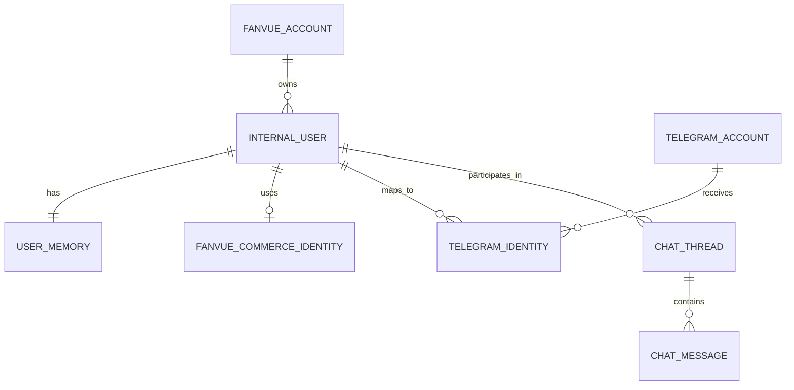
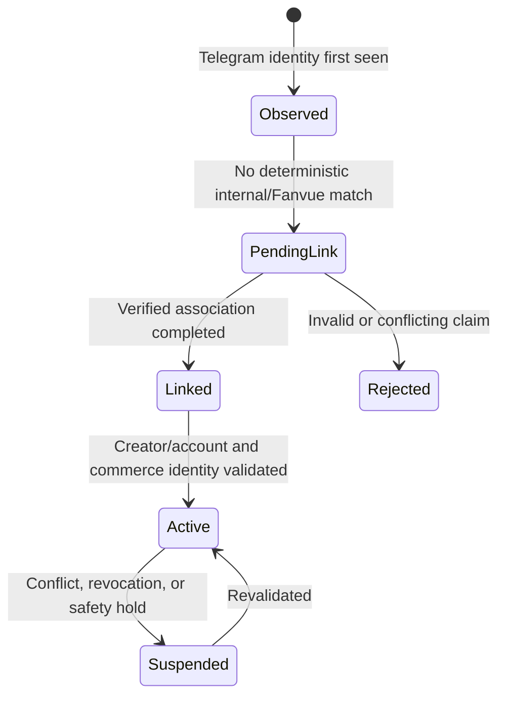
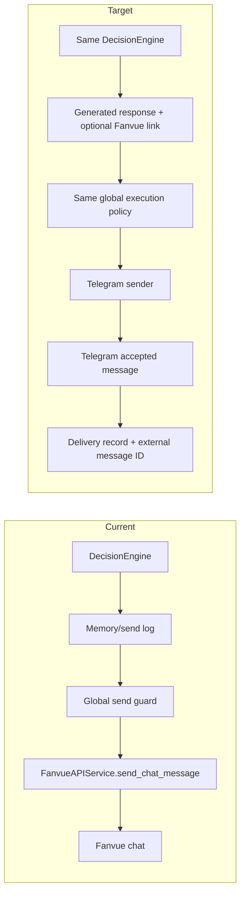
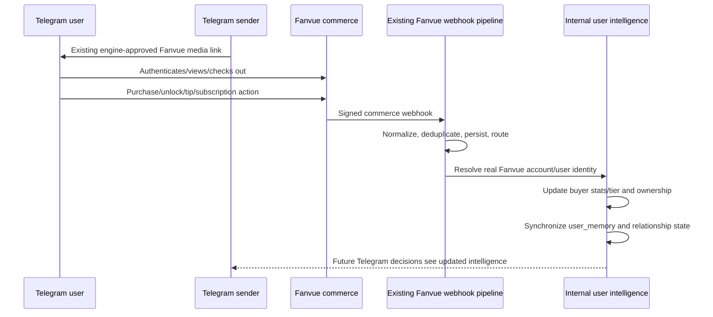

# FanvueChatbot to Telegram Migration Map

## 1. Executive Summary

This blueprint migrates only the conversational transport layer. FanvueChatbot remains the single intelligence platform; Telegram becomes the primary conversation channel; Fanvue remains the checkout, media-hosting, media-link, purchase, subscription, unlock, tip, ownership, and buyer-signal platform; KVIQA remains a separate CRM layer.

The migration must not create a Telegram chatbot beside FanvueChatbot. It must place a thin Telegram adapter around the existing application brain:

```text
Telegram user
  -> Telegram transport adapter
  -> unified identity mapper
  -> existing internal user
  -> existing DecisionEngine and memory
  -> Telegram transport adapter
  -> Telegram response
```

The core identity decision is intentionally conservative. During this migration, the current creator-scoped local user record—`fanvue_users.id` under `fanvue_account_id`—continues to function as the canonical internal intelligence owner. Existing `user_memory`, buyer intelligence, ownership, relationship state, messages, and analytics continue to reference it. Telegram identities are attached to that user through an additive mapping. No Telegram-only user, memory, buyer profile, or relationship profile is permitted.

This choice avoids a broad internal-user rewrite, but creates an explicit activation rule: a Telegram contact must be deterministically mapped to the correct creator-scoped internal/Fanvue commerce identity before live DecisionEngine processing. Unknown or ambiguous contacts must enter a non-intelligence pending-link state; they must not receive a fabricated Fanvue UUID or a parallel memory record.

The present live Fanvue message path combines ingestion, identity lookup, persistence, DecisionEngine invocation, delivery guarding, and Fanvue sending. The target separates those concerns into a normalized message boundary, a brain gateway, and channel-specific senders. The DecisionEngine, prompts, relationship intelligence, buyer systems, offer/content selection, safety controls, and Fanvue commerce webhook pipeline remain behaviorally authoritative.

All database work proposed here is additive and planning-only. The plan calls for identity/account mappings, transport-neutral conversation identifiers, idempotency, and delivery tracking. No tables, columns, indexes, code, or runtime behavior are created by this report.

The implementation is divided into reversible, independently testable phases. Fanvue chat transport remains available as the rollback path until Telegram identity, shadow processing, delivery, purchase attribution, and memory continuity have passed explicit gates.

## 2. System Classification Matrix

Classification meanings:

- **KEEP:** retain behavior and ownership substantially unchanged.
- **ADAPT:** retain the subsystem but add a boundary, mapping, or channel-aware interface.
- **REPLACE:** replace only the transport-specific implementation with a Telegram equivalent.
- **REMOVE:** exclude from the target architecture; this does not authorize immediate deletion during migration.

| Major subsystem | Classification | Target disposition | Rationale |
|---|---|---|---|
| `DecisionEngine.process_message()` | **KEEP** | Remains the single conversational decision owner | Core intellectual property and stable brain entry point |
| Intent, mode, situation routing, objection handling | **KEEP** | Continue unchanged behind the brain boundary | Telegram transport must not reinterpret messages |
| MemoryService and `user_memory` | **KEEP** | Same records, fields, and mutation behavior | Required for continuity; no Telegram memory store |
| Buyer intelligence and buyer-memory sync | **KEEP** | Continue to consume Fanvue commerce events | Telegram has no authoritative purchase data |
| Relationship, emotional, intimacy, continuity, whale, dependency services | **KEEP** | Preserve all current behavior | Core relationship intelligence |
| Personas, creator profiles, prompts, OpenAI/Grok orchestration | **KEEP** | Remain authoritative for response generation | Reject Telegram reference prompts/models |
| Offer, timing, gating, post-offer, buyer-session logic | **KEEP** | Decide if/when/what to offer | Telegram adapter only transports the result |
| Content selection and ownership suppression | **KEEP** | Continue selecting Fanvue-hosted content and links | Preserves commerce and prevents reselling owned content |
| Fanvue media upload/vault/link services | **KEEP** | Continue as media-hosting/commerce infrastructure | Fanvue remains media platform |
| Fanvue OAuth/token/account management | **KEEP** | Continue for commerce APIs and webhooks | Required after chat cutover |
| Fanvue monetization webhooks | **KEEP** | Continue purchase/unlock/tip/subscription ingestion | Critical feedback into buyer and memory systems |
| Fanvue relationship/insight sync | **KEEP** | Continue enriching internal user state | Commerce/relationship data remains Fanvue-backed |
| Global automation/send/content safety guards | **ADAPT** | Reuse before Telegram sends and Fanvue commerce operations | Channel-aware execution without duplicating policy |
| User repository | **ADAPT** | Keep existing canonical user; add Telegram identity lookup | Unified identity without rewriting all foreign keys |
| Chat thread/message repositories | **ADAPT** | Add transport-neutral account/chat/message identity | Preserve history retrieval while supporting Telegram |
| Send log/analytics | **ADAPT** | Distinguish generation, attempt, acceptance, failure, channel | Current engine logging precedes actual delivery |
| Realtime decision trigger | **ADAPT** | Extract/reuse a channel-neutral brain gateway responsibility | Current implementation is Fanvue-coupled and monolithic |
| Proactive outreach/reaction/follow-up intelligence | **ADAPT** | Preserve decision logic; route conversation delivery by channel | Existing executors often send directly to Fanvue |
| Fanvue inbound chat webhook route | **REPLACE** | Telegram listener becomes primary conversation ingestion | Retain Fanvue commerce webhook routes |
| Fanvue realtime chat message normalizer | **REPLACE** | Telegram event normalizer for conversation messages | Payload and identifiers are platform-specific |
| Fanvue outbound chat send | **REPLACE** | Telegram sender for conversational responses | Fanvue API remains for commerce/media, not primary chat |
| Fanvue polling/message synchronization | **REPLACE** | Telegram event-based conversation synchronization | Retain temporarily for rollback/audit if needed |
| Fanvue-specific conversation routing | **REPLACE** | Channel-neutral message application flow | Decision routing itself remains in DecisionEngine |
| Telegram authentication/session lifecycle | **ADAPT** | Recreate inside FanvueChatbot from validated Telethon patterns | Reference code is not directly reusable |
| Telegram listener/sender/media primitives | **ADAPT** | New internal integration components | Thin transport layer only |
| Legacy Telegram `database.py` | **REMOVE** | Never imported or migrated | Would create a second user/memory system |
| Legacy Telegram `logic.py` | **REMOVE** | Excluded | Duplicates emotional, funnel, heat, CTA, and sales intelligence |
| Legacy Telegram `timing.py` | **REMOVE** | Excluded | Duplicates application timing/engagement behavior |
| Legacy Telegram `gpt.py` and `grok.py` | **REMOVE** | Excluded | Duplicates prompts, personas, classifiers, and model orchestration |
| Legacy Telegram country tiers, CTA/HP modes, conversion inference | **REMOVE** | Excluded | Conflicts with preserved buyer/offer systems |
| Direct Telegram paid-media replacement for Fanvue | **REMOVE** from initial scope | Deliver Fanvue media links instead | Avoids bypassing checkout and ownership |
| KVIQ Bot | **REMOVE** from migration scope | No integration or replacement work | Context explicitly excludes it |
| KVIQA CRM | **KEEP** as external layer | Remains separate from chat migration | Not the conversation or intelligence platform |

## 3. Identity Architecture

### 3.1 Identity invariant

The non-negotiable invariant is:

```text
one real person within one creator/account scope
  -> one canonical internal user
  -> one existing intelligence/memory graph
  -> zero channel-specific intelligence profiles
```

The target relationship is:



For migration purposes:

- `fanvue_accounts.id` remains the internal creator/tenant identifier.
- `fanvue_users.id` remains the canonical internal user identifier.
- `fanvue_users.fanvue_user_uuid` remains the Fanvue commerce identity.
- `user_memory(fanvue_account_id, fanvue_user_id)` remains the intelligence memory owner.
- A new planned Telegram identity mapping points to the existing `fanvue_users.id`.
- The current engine key remains `fanvue_account_id:fanvue_users.id` initially.

“Internal user” is therefore a role played by the current local Fanvue user row, not a proposal to create Telegram users in `fanvue_users` with fake Fanvue values. A later neutral rename or broader identity refactor is explicitly outside this transport migration.

### 3.2 Required Telegram identity scope

The mapper must use all of the following:

| Field | Purpose |
|---|---|
| Managed Telegram account ID | Creator/persona/tenant scope; prevents cross-account collisions |
| Telegram user ID (`sender.id`) | Stable external Telegram person identifier |
| Telegram chat ID (`event.chat_id`) | Conversation peer identifier |
| Telegram message ID | Idempotency and delivery correlation within account/chat scope |
| Internal creator/account ID | Selects creator profile, Fanvue account, and tenant data |
| Internal user ID | Owns memory, buyer intelligence, relationship state, and history |
| Fanvue user UUID | Resolves checkout, purchase, unlock, subscription, tip, and ownership events |

Telegram username, first name, and last name are refreshable metadata only. They are never linkage keys. Phone numbers should not be assumed available or used without a separately authorized identity policy.

### 3.3 Mapping lifecycle



Rules:

1. Observation may record transport identity and the inbound event for operational handling, but must not create `user_memory`, buyer intelligence, or a fake Fanvue user.
2. DecisionEngine execution is allowed only for an **Active** mapping.
3. Linkage must be deterministic and auditable—for example, an authenticated Fanvue association or a controlled creator-side mapping workflow. Username similarity is not acceptable.
4. A mapping is always creator-scoped. The same Telegram user may legitimately map differently across different managed creator accounts.
5. Conflicting Telegram-to-Fanvue claims fail closed and require review.
6. Fanvue commerce webhooks continue resolving by real Fanvue account/user identifiers and thereby update the same canonical internal user.

### 3.4 Existing-user preservation

No existing `fanvue_users.id`, `fanvue_user_uuid`, memory key, buyer record, ownership record, or relationship record should be rewritten during initial linkage. Adding a Telegram mapping to an existing user immediately gives Telegram conversations access to that user's established intelligence history.

If historical Fanvue messages are retained, they remain history for the same internal user. Target chat-history retrieval may include channel metadata, but the DecisionEngine continues receiving normalized `user`/`assistant` turns.

### 3.5 Identity repository requirements

Planning calls for repositories with these responsibilities:

- Resolve a managed Telegram account/session to one internal creator/Fanvue account and persona.
- Resolve `(telegram_account_id, telegram_user_id)` to exactly one internal user.
- Resolve a Telegram chat to the appropriate internal conversation thread.
- Return linkage status and block reasons, not merely `None`.
- Create/update observation metadata without creating intelligence records.
- Link/unlink/suspend mappings through auditable operations.
- Detect uniqueness conflicts and creator/account crossover.
- Resolve an internal user back to a Telegram delivery destination for proactive responses.

### 3.6 Identity failure behavior

| Condition | Required behavior |
|---|---|
| No mapping | Do not call DecisionEngine; hold/record as pending or send an approved non-brain linkage response |
| Multiple internal matches | Fail closed and alert; never guess |
| Mapping points across creator accounts | Block as tenant-integrity failure |
| Missing real Fanvue commerce UUID | Do not activate monetization/intelligence flow |
| Mutable username changed | Refresh metadata; preserve numeric-ID mapping |
| Telegram account/session changed | Require explicit account mapping; do not reuse by session filename alone |
| Fanvue identity revoked/merged | Suspend mapping until commerce identity is reconciled |

## 4. Current vs Target Message Flow

### 4.1 Inbound conversation flow

| Stage | Current Fanvue flow | Target Telegram flow |
|---|---|---|
| Receive | Fanvue posts signed webhook | Telethon receives incoming private event |
| Authenticate | Verify Fanvue webhook signature | Use authorized managed Telegram session/client |
| Normalize | Extract Fanvue topic, event, account, user, thread, text | Extract Telegram account, user, chat, message, timestamp, text/media metadata |
| Deduplicate | Webhook external event ID | `(telegram_account, chat_id, message_id)` |
| Identity | Look up `fanvue_users` by account + Fanvue UUID | Map Telegram identity to existing internal user + Fanvue commerce UUID |
| Persist | `fanvue_chat_messages`, then thread/message paths | Transport-neutral thread/message record under same internal user |
| History | Current live trigger passes empty history | Retrieve normalized recent history before the brain call |
| Brain | `DecisionEngine.process_message()` | Same method through a channel-neutral brain gateway |
| Memory | Existing `user_memory` updates | Same record and same behavior |

### 4.2 Outbound conversation flow



Target rules:

- The DecisionEngine generates once per accepted inbound message.
- A transport retry resends the stored generated response; it never reruns the DecisionEngine.
- Telegram acknowledgment supplies the external outbound message ID.
- Delivery state is recorded separately from generation/send-log state.
- Outbound memory counter semantics must be explicitly defined as generated or accepted. Until changed safely, reports must not label a pre-send increment as successful delivery.
- Existing safety guards execute before the Telegram API call.

### 4.3 Memory update flow

Current and target memory mutations remain owned by the existing brain and commerce services:

```text
linked Telegram inbound message
  -> same internal engine user key
  -> same MemoryService read
  -> same DecisionEngine classifications/routes/offers
  -> same MemoryService writes
  -> Telegram delivery result tracked separately
```

The adapter may persist transport facts, but it must not write intent scores, buyer tiers, relationship state, offer state, emotional state, or conversation strategy.

### 4.4 Purchase and ownership flow



No Telegram callback is authoritative for a Fanvue purchase. Fanvue remains the source of truth. Link delivery alone must not mark ownership or conversion.

### 4.5 Proactive and post-purchase messages

Existing outreach, reaction, delayed-follow-up, tip reward, subscription welcome, and thank-you decisions should remain. Their delivery executors need a later channel-routing adaptation:

1. Determine the existing internal user and approved action.
2. Resolve that user's active conversation channel/destination.
3. Apply existing execution/safety guards.
4. Deliver through Telegram when it is the active conversation channel.
5. Record channel-specific delivery results.

This work must not be bundled into the first inbound-message implementation phase.

## 5. Transport Boundary Design

### 5.1 Boundary definition

Telegram begins and ends at `app/integrations/telegram/`:

```text
Telegram-owned concerns
  authentication/session/client lifecycle
  event subscription and Telegram-specific filtering
  Telegram ID/entity extraction
  Telegram error translation
  text/link/media transmission
  Telegram delivery acknowledgment

Application-owned concerns
  canonical identity and tenant validation
  conversation persistence/history
  memory and relationship state
  intent/routing/mode
  buyer intelligence
  offer/content decisions
  prompt/model execution
  safety and automation policy
```

The boundary object between them should be transport-neutral.

### 5.2 Normalized inbound contract

Conceptual fields:

| Field | Requirement |
|---|---|
| `platform` | Constant `telegram` |
| `external_account_id` | Managed Telegram account/session identity |
| `external_user_id` | Telegram `sender.id` |
| `external_chat_id` | Telegram chat/peer ID |
| `external_message_id` | Telegram message ID |
| `occurred_at` | Telegram event timestamp normalized to UTC |
| `text` | Text or caption; explicit empty-content behavior |
| `media` | Metadata only in initial scope unless media is separately supported |
| `reply_to_message_id` | Optional threading/context metadata |
| `raw_reference` | Minimal auditable metadata, excluding unnecessary secrets/PII |

The normalizer performs no database business-state updates and no intelligence classification.

### 5.3 Brain gateway contract

The channel-neutral application gateway receives:

```text
internal account ID
internal user ID / existing engine key
internal thread ID
normalized message text
recent normalized chat history
optional transport metadata that cannot affect business policy directly
```

It returns:

```text
generated response text
existing DecisionEngine decision metadata
optional engine-approved Fanvue media link/content metadata
delivery policy/guard result
correlation ID for one generation
```

The gateway is the point at which Telegram ends and DecisionEngine orchestration begins. It may initially wrap the current singleton DecisionEngine to minimize change. It must not fork or simplify the engine pipeline.

### 5.4 Normalized outbound contract

Conceptual fields:

| Field | Purpose |
|---|---|
| Internal correlation/generation ID | Prevents re-generation on retry |
| Telegram account ID | Selects client/session |
| Telegram chat ID | Explicit destination |
| Text | Exact application-approved response |
| Fanvue link metadata | Optional; selected by existing offer/content logic |
| Formatting/link-preview policy | Telegram representation only |
| Reply target | Optional Telegram reply behavior |
| Idempotency key | Prevents duplicate sends where application control permits |
| Safety decision | Proof that execution guard passed |

The sender returns an external message ID, acceptance timestamp, and structured status/error. It never decides offer eligibility or rewrites the response's business meaning.

### 5.5 Boundary anti-corruption rules

- No Telethon types cross into DecisionEngine or memory services.
- No FanvueChatbot repository row objects are passed directly into Telethon APIs.
- No Telegram reference logic imports are permitted.
- No channel-specific identifier becomes the memory key.
- No sender method calls an LLM or classifier.
- No listener computes timing, CTA, price, funnel, heat, buyer, or relationship state.
- No transport error triggers a second DecisionEngine call.
- No Fanvue commerce API is removed merely because Fanvue chat is replaced.

## 6. Telegram Integration Components

The following are planned components, not files created by this report.

```text
app/integrations/telegram/
├── config.py
├── models.py
├── client_manager.py
├── session_service.py
├── listener.py
├── event_normalizer.py
├── identity_mapper.py
├── sender.py
├── delivery_tracker.py
├── error_policy.py
└── media_service.py        # initially link/free-media boundary only

app/services/
└── conversation_gateway.py # channel-neutral application boundary

app/repositories/
├── telegram_identity_repository.py
├── telegram_account_repository.py
└── transport_delivery_repository.py
```

| Component | Responsibility | Explicit exclusions |
|---|---|---|
| Telegram config | Chosen auth mode, API credentials, secure session reference, account/persona map, feature flags | LLM/CTA/offer configuration |
| Client manager | Construct clients, connect, health, reconnect, graceful shutdown, select client by account | User memory and response generation |
| Session service | One-time authorization workflow and secure session lifecycle | Persona/business behavior |
| Listener | Register private incoming events and hand supported events to normalizer/gateway | Direct DecisionEngine internals or sales logic |
| Event normalizer | Convert Telethon event to normalized inbound contract | Identity guessing or DB intelligence writes |
| Identity mapper | Resolve Telegram external identity to active canonical internal/Fanvue identity | Creating Telegram-only users |
| Conversation gateway | Deduplicate, persist, fetch history, invoke existing DecisionEngine once, return output | Telegram API calls |
| Sender | Text/link formatting, supported typing action, send, Telegram-specific errors | Offer selection and link eligibility |
| Delivery tracker | Persist generation/attempt/accepted/failed status and external ID | Buyer or relationship updates |
| Error policy | Classify flood waits, auth/session errors, blocked peer, transient RPC/network errors | Generic silent exception handling |
| Media service | Optional direct free-media transport primitives; Fanvue-link representation | Paid content selection or checkout replacement |

### 6.1 Authentication choice gate

Before implementation, the project must explicitly approve either:

- **User-session MTProto:** matches the legacy reference pattern and may support creator-account DM behavior, but requires phone authorization, protected bearer sessions, account policy review, and strict single-session operations.
- **Bot-token session:** simpler secret lifecycle but different Telegram capabilities and user interaction constraints.

The blueprint does not silently choose one because the reference repository configures both while only implementing the former. The implementation task must not begin until this gate is resolved.

### 6.2 Initial media scope

Initial Telegram media scope should be:

- Send text.
- Send engine-approved Fanvue media/checkout links.
- Optionally control link preview.
- Recognize media-only inbound events and record/decline them explicitly rather than silently discarding them.

Direct photo/video/file sending should remain disabled until free-media use cases, safety, size, caching, and commerce-boundary rules are approved.

## 7. Fanvue Commerce Preservation Plan

### 7.1 Systems that remain active

| Fanvue capability | Preservation plan |
|---|---|
| OAuth/token management | Continue unchanged for API and webhook access |
| Creator/account records | Continue as tenant and commerce-account boundary |
| Fan/user UUIDs | Remain authoritative commerce identities |
| Media uploads and vault | Continue hosting previews/full media |
| Content catalog links | Continue producing the links selected by Offer/Content services |
| Checkout | Remains exclusively Fanvue-backed |
| Purchases and unlocks | Existing signed webhook ingestion remains active |
| Tips | Existing webhook and buyer-stat update remains active |
| Subscriptions/cancellations | Existing lifecycle handlers remain active |
| Ownership records | Continue suppressing repeat offers and informing prompts |
| Buyer intelligence/tier refresh | Continue updating from Fanvue events |
| Buyer-memory synchronization | Continue writing to the same `user_memory` row |
| Fan insights/relationship sync | Continue enriching profiles |
| Post-purchase decisions/reactions | Preserve intelligence; adapt delivery channel separately |
| Fanvue wall/broadcast operations | Out of conversation cutover; preserve unless separately retired |

### 7.2 Commerce boundary

Telegram may transport:

- Offer copy generated by FanvueChatbot.
- Fanvue media/checkout links selected by existing content/offer logic.
- Post-purchase acknowledgments authorized by existing reaction logic.

Telegram may not:

- Mark a purchase, unlock, tip, or subscription as completed.
- Generate a substitute ownership record.
- Decide that paid media is free.
- Host paid content as a replacement for Fanvue without a separate approved project.
- Infer conversion merely because a link was sent or clicked.

### 7.3 Purchase attribution requirements

Before link delivery is enabled, tests must prove:

1. The active Telegram identity maps to a real internal/Fanvue commerce user.
2. The user follows the Fanvue link under the linked Fanvue identity or an approved, auditable attribution mechanism.
3. The Fanvue webhook contains identifiers resolvable to the same internal user.
4. Deduplicated commerce processing updates buyer stats, ownership, and `user_memory` once.
5. The next Telegram message observes the new buyer/ownership state.

If the existing Fanvue link flow cannot guarantee item 2, link attribution requires a separately designed signed correlation mechanism or controlled account-linking flow. Raw internal IDs must not be exposed in URLs, and Telegram usernames must not be used as commerce attribution.

### 7.4 Fanvue webhook separation

The current `/webhooks/fanvue` endpoint and event router handle both chat and commerce events. Migration must separate operational disposition without removing the shared durable ingestion controls:

- Fanvue `message_received`: disabled as the primary conversation trigger only after Telegram cutover.
- Purchase, unlock, tip, subscription, and related commerce events: remain enabled.
- Signature verification, event deduplication, persistence, retry state, and commerce routing: remain enabled.

Rollback must be able to re-enable Fanvue conversation triggering without changing commerce processing.

## 8. Database Impact Analysis

This section describes planned schema impact only. It does not create or modify any database object.

### 8.1 Design principles

- Add before changing; do not rename/drop existing Fanvue columns during transport migration.
- Keep `fanvue_users.id` as the canonical internal user key initially.
- Never create a Telegram-specific memory or buyer table.
- Scope every Telegram identifier by the managed Telegram account/creator.
- Persist external message IDs for idempotency and delivery audit.
- Keep sessions/secrets out of ordinary relational metadata unless using an approved encrypted reference mechanism.
- Use constraints to enforce identity invariants, not application convention alone.

### 8.2 Planned new logical tables

Names are recommendations and may be adjusted during schema design.

#### `telegram_accounts`

Purpose: map each managed Telegram client/session to one existing internal creator/Fanvue account and persona.

Planned fields:

- Local primary key.
- Stable Telegram account/user ID of the managed account after authorization.
- `fanvue_account_id` foreign key.
- Creator profile/persona reference or unambiguous configuration key.
- Authentication mode (`user_session` or `bot_token`).
- Secure session/secret reference—not raw session content.
- Status (`pending`, `active`, `suspended`, `revoked`).
- Created/updated/last-connected timestamps.

Planned constraints/indexes:

- Unique managed Telegram account ID.
- Unique active mapping for the intended creator/persona scope.
- Index on `fanvue_account_id` and status.

#### `telegram_identities`

Purpose: attach an external Telegram user to an existing canonical internal user.

Planned fields:

- Local primary key.
- `telegram_account_id` foreign key.
- Numeric Telegram user ID.
- `fanvue_account_id` for explicit tenant validation.
- `fanvue_user_id` foreign key to the existing local user.
- Link status and link method.
- Verification/audit correlation, linked/suspended timestamps.
- Refreshable username, first name, last name, language metadata.

Planned constraints/indexes:

- Unique `(telegram_account_id, telegram_user_id)`.
- Unique mapping policy preventing one active Telegram identity from resolving to multiple internal users.
- Composite foreign-key or application-validated constraint ensuring `fanvue_user_id` belongs to `fanvue_account_id`.
- Index on `(fanvue_account_id, fanvue_user_id)` for reverse delivery lookup.
- Index on status for pending-link operations.

#### `transport_deliveries`

Purpose: track outbound generation and channel delivery independently of DecisionEngine send logs.

Planned fields:

- Local primary key and internal correlation/generation ID.
- Platform and managed external account ID.
- Internal user/thread/message references.
- External chat ID and outbound Telegram message ID.
- Idempotency key.
- Status (`generated`, `attempting`, `accepted`, `retryable_failed`, `permanent_failed`, `cancelled`).
- Attempt count, structured error code/class, retry-after, timestamps.
- Hash/reference to payload; avoid duplicating sensitive raw content unnecessarily.

Planned constraints/indexes:

- Unique internal idempotency key.
- Unique external outbound message key when present.
- Index on status/retry time for workers.
- Index on internal user/thread and creation time for audit.

An alternative is extending an existing send-log table. That is acceptable only if it can represent generation separately from transport attempts without changing existing analytics semantics unexpectedly.

### 8.3 Planned changes to existing conversation tables

To minimize parallel message stores, adapt `chat_threads` and `chat_messages` rather than importing the legacy Telegram tables.

Potential additive `chat_threads` fields:

- `platform` or `transport_type` with existing rows defaulted/identified as Fanvue.
- Managed transport account reference.
- Generic `external_chat_id`.
- Optional channel status and last-seen external metadata.

Potential constraints/indexes:

- Unique `(platform, transport_account, external_chat_id)`.
- Index on `(fanvue_account_id, fanvue_user_id, platform)`.

Potential additive `chat_messages` fields:

- `platform` or `transport_type`.
- Generic `external_message_id`.
- External reply-to message ID.
- Internal correlation/generation ID.
- Delivery status for outbound messages or a reference to `transport_deliveries`.
- Normalized media metadata if inbound media observation is supported.

Potential constraints/indexes:

- Unique inbound identity `(platform, transport_account, external_chat_id, external_message_id)`.
- Index on thread and sent/occurred time for history retrieval.
- Index on correlation ID for delivery reconciliation.

Existing `fanvue_chat_uuid` and `fanvue_message_uuid` fields should remain during migration. They can coexist with generic fields; removing or renaming them is not required for Telegram cutover.

### 8.4 Existing tables with no new intelligence copy

No Telegram-specific replacement is allowed for:

- `user_memory`.
- Buyer intelligence.
- Content ownership/unlock records.
- Monetization events.
- Creator profiles/personas.
- Offer/content analytics.
- Relationship or intimacy memory.

These continue referencing the canonical internal user.

### 8.5 Data backfill and validation plan

Before enabling Telegram:

1. Register managed Telegram account metadata and map each to the correct Fanvue creator/account.
2. Load Telegram-to-internal mappings only from verified source data/workflow.
3. Validate every active mapping has exactly one existing local user and real Fanvue UUID.
4. Validate no Telegram identity crosses tenant/account boundaries.
5. Validate reverse mapping for proactive delivery is unique.
6. Mark existing chat rows explicitly as Fanvue where generic platform fields are added.
7. Create indexes/constraints only after duplicate/conflict audits pass.
8. Produce counts for active, pending, conflicting, and unmapped identities.

### 8.6 Rollback characteristics

All proposed schema work is additive. Rollback disables Telegram feature flags/listeners and resumes Fanvue chat delivery; mapping and delivery audit rows may remain inert. No rollback requires deleting user memory or commerce data. Destructive schema cleanup should be a separate post-stabilization project, not part of cutover.

## 9. Phased Implementation Plan

Each phase has an entry gate, isolated scope, verification, and rollback.

### Phase 0 — Contract freeze and baseline

Scope:

- Freeze DecisionEngine input/output and current memory mutation expectations.
- Select representative user states: new, follower, subscriber, buyer, whale, post-offer, owner, lapsed, and safety-suppressed.
- Establish golden fixtures for routing, responses/response properties, offers, and memory deltas.
- Inventory existing Fanvue chat and commerce feature flags.

Test gate:

- Existing test suite and golden scenarios pass without Telegram code.
- Current Fanvue commerce webhook flow is demonstrably healthy.

Rollback:

- Documentation/tests only; no runtime change.

### Phase 1 — Authentication and identity decisions

Scope:

- Approve user-session versus bot-token operation.
- Finalize managed Telegram account/persona/creator mapping.
- Finalize canonical internal-user invariant and pending-link policy.
- Approve additive schema and security design.

Test gate:

- Threat review for session handling.
- Sample identities resolve uniquely on paper/test fixtures.
- Ambiguous, unmapped, and cross-account cases fail closed.

Rollback:

- No runtime behavior; revise contracts before implementation.

### Phase 2 — Additive identity persistence

Scope:

- Implement approved Telegram account and identity mappings plus repositories.
- Add audit/status behavior.
- Do not run a Telegram listener.
- Do not create Telegram memory or buyer rows.

Test gate:

- Unique and tenant-integrity constraints.
- Forward and reverse mapping tests.
- Existing Fanvue user/memory queries remain unchanged.
- Schema migration up/down tested on a non-production copy.

Rollback:

- Disable repositories; reverse additive migration if necessary. Existing data remains untouched.

### Phase 3 — Channel-neutral conversation gateway

Scope:

- Establish normalized inbound/outbound contracts.
- Wrap the existing DecisionEngine entry point without changing its internals.
- Persist/retrieve recent normalized history.
- Add generation correlation and idempotency boundaries.
- Exercise initially through tests or the current Fanvue path.

Test gate:

- Golden DecisionEngine scenarios remain equivalent.
- One inbound correlation invokes DecisionEngine exactly once.
- Transport retries do not reinvoke the brain.
- Existing Fanvue chat path can still use/avoid the gateway behind a flag.

Rollback:

- Disable gateway routing and return to current realtime trigger.

### Phase 4 — Telegram client/session runtime

Scope:

- Implement chosen authorization, secure session reference, client health, reconnect, and graceful shutdown.
- No message reaches DecisionEngine.
- Use a dedicated test Telegram account/persona.

Test gate:

- First authorization, restart, disconnect/reconnect, revoked-session, and single-instance tests.
- No session secret appears in logs or source control.

Rollback:

- Stop the isolated Telegram runtime; no application behavior affected.

### Phase 5 — Listener in capture-only mode

Scope:

- Receive private messages, normalize IDs/content, deduplicate, and resolve identity.
- Record supported transport events without mutating intelligence memory.
- Explicitly classify media-only/unsupported events.

Test gate:

- Duplicate, edit, ordering, concurrent, media-only, deleted-sender, and mutable-username cases.
- No DecisionEngine or `user_memory` write occurs.

Rollback:

- Disable listener feature flag; retain audit rows for diagnosis.

### Phase 6 — Decision shadow/QA mode

Scope:

- For isolated test identities, invoke the real gateway with outbound Telegram sending disabled.
- Compare route, offer, response, and memory deltas to baselines.
- Do not shadow-process production messages if doing so would mutate live memory twice.

Test gate:

- End-to-end Telegram event to DecisionEngine result for dedicated QA users.
- History is present and correctly ordered.
- One message causes one intended memory mutation set.

Rollback:

- Disable brain invocation; return to capture-only listener.

### Phase 7 — Controlled Telegram text/link delivery

Scope:

- Enable sender for allowlisted QA identities only.
- Apply global send guards.
- Persist Telegram outbound IDs and delivery states.
- Support text and engine-approved Fanvue links; direct media remains off.

Test gate:

- Formatting, message length, link preview, typing, blocked peer, flood wait, transient failure, retry, and duplicate-send tests.
- Transport retries reuse the stored response.
- Successful-delivery analytics match Telegram acknowledgments.

Rollback:

- Disable outbound feature flag while keeping capture/shadow available.

### Phase 8 — Commerce continuity validation

Scope:

- Execute controlled Fanvue link, purchase/unlock/tip/subscription journeys from mapped Telegram identities.
- Verify existing webhook processing and post-purchase intelligence.
- Route selected QA acknowledgments back through Telegram if separately enabled.

Test gate:

- One commerce event updates the correct existing buyer/ownership/memory records once.
- Next Telegram decision observes the update.
- No cross-user or cross-creator attribution.

Rollback:

- Disable Telegram commerce-link sends/acknowledgments; Fanvue commerce webhook processing remains active.

### Phase 9 — Limited production rollout

Scope:

- Enable selected creators/users in cohorts.
- Maintain Fanvue chat path as rollback, but prevent dual processing for the same conversation.
- Monitor identity misses, latency, duplicate rate, send failures, offer behavior, and purchase attribution.

Test gate:

- Predefined error, continuity, delivery, and attribution thresholds remain healthy through observation window.
- Manual rollback drill succeeds.

Rollback:

- Disable Telegram processing per account/cohort and reactivate Fanvue chat route without touching commerce.

### Phase 10 — Primary transport cutover and stabilization

Scope:

- Make Telegram primary for approved creator accounts.
- Disable Fanvue `message_received` as a conversation trigger, not the entire Fanvue webhook endpoint.
- Keep rollback flags and legacy paths through stabilization.

Test gate:

- Relationship/memory continuity, buyer updates, offer links, delivery, and operational health meet acceptance criteria.
- No dual sends or dual brain invocation.

Rollback:

- Re-enable Fanvue conversation trigger and disable Telegram account listener/sender.

### Phase 11 — Deferred cleanup

Scope:

- Only after sustained success, identify obsolete Fanvue chat-only paths and legacy reference artifacts.
- Cleanup is a separate reviewed task.

Test gate:

- No commerce, analytics, history, or rollback dependency remains.

Rollback:

- Preserve code/data until cleanup has its own recovery plan. No cleanup is authorized by this blueprint.

## 10. Risk Analysis

| Risk | Severity | Failure mode | Mitigation/control |
|---|---|---|---|
| Identity fragmentation | Critical | Telegram creates a new user/memory profile | Hard mapping to existing internal user; no active mapping without real Fanvue identity |
| Incorrect identity merge | Critical | Two people share intelligence/purchases | Creator-scoped numeric IDs, verified linking, unique constraints, fail closed |
| Purchase attribution failure | Critical | Purchase updates wrong/no Telegram user's buyer memory | End-to-end link/auth/webhook tests before rollout; real Fanvue UUID remains source |
| Dual processing | Critical | Fanvue and Telegram both invoke brain for same interaction | Per-account transport mode and idempotency; explicit cutover flags |
| Duplicate Telegram events | High | Counters/offers/memory mutate twice | Unique account/chat/message key before brain invocation |
| Concurrent message race | High | Stale memory and out-of-order replies | Per-chat serialization/locking and ordered queueing |
| Transport retry reruns brain | High | New response and duplicate memory mutation | Persist generation; retry sender only |
| Async/sync starvation | High | Telethon listener stalls during DB/LLM work | Isolate blocking gateway work with bounded concurrency |
| Delivery accounting mismatch | High | Generated reply reported as delivered | Separate delivery table/status; capture Telegram message ID |
| Conversation history gap | High | Lower-quality or discontinuous responses | Retrieve normalized recent messages before every gateway call |
| Commerce webhook accidentally disabled | Critical | Buyer/ownership intelligence stops updating | Separate chat event cutover from commerce ingestion; regression monitor |
| Session credential compromise | Critical | Telegram account takeover | Protected session storage/reference, least access, log redaction, revocation plan |
| User-session policy risk | High | Account restrictions or operational failure | Authentication choice gate and policy review before implementation |
| Multi-persona crossover | High | Wrong creator voice/account responds | Telegram-account-to-creator/persona invariant and isolation tests |
| Direct media bypass | High | Paid content leaks outside Fanvue | Link-only initial scope; explicit media safety gate |
| Proactive executor remains Fanvue-bound | High | Reactions/follow-ups go to wrong channel or disappear | Defer, inventory, then add channel routing per executor |
| Legacy Telegram logic contamination | Critical | Second brain changes behavior | No imports/dependency; review package boundaries and dependency graph |
| Database migration regression | High | Existing Fanvue queries/history break | Additive changes, copy testing, no renames/drops, feature flags |
| Unmapped Telegram contact | Medium-high | User receives no response or wrong onboarding | Defined pending-link experience and operational queue; never guess |
| Unsupported media message | Medium | Silent user experience failure | Explicit unsupported/media observation and approved response policy |
| Flood wait/RPC failure | Medium-high | Delayed/failed delivery and duplicate retries | Structured error policy, retry-after, bounded retries, idempotency |
| PII leakage in logs | High | Telegram content/user metadata exposed | Structured redacted logging and minimal raw payload retention |
| Rollback produces duplicate messages | High | Both transports activate during recovery | Tested account-scoped switch with single active conversation channel |

### 10.1 Highest-risk gates

The project must not progress to live Telegram replies until all five gates pass:

1. **Authentication model approved.** User session versus bot token is explicit and operationally supported.
2. **Identity invariant proven.** Every enabled Telegram identity resolves uniquely to the intended existing internal/Fanvue commerce user.
3. **Idempotency proven.** One Telegram inbound message causes at most one DecisionEngine execution.
4. **Commerce continuity proven.** Fanvue purchases/unlocks update the same user's buyer, ownership, and memory state.
5. **Rollback proven.** Telegram can be disabled and Fanvue chat restored without disabling Fanvue commerce webhooks or causing dual sends.

### 10.2 Observability required for rollout

Monitor per managed Telegram account and cohort:

- Received, duplicate, unsupported, unmapped, ambiguous, processed, and failed inbound events.
- DecisionEngine invocation count versus unique inbound count.
- Generation latency and Telegram send latency.
- Delivery acceptance, retryable failure, permanent failure, and flood-wait rates.
- Identity mapping status and cross-tenant conflict attempts.
- Fanvue link sends, purchases/unlocks, attribution failures, and time-to-memory-update.
- Memory/buyer/ownership continuity checks.
- Fanvue-versus-Telegram active transport mode and any dual-send detection.

## 11. Recommended Next Implementation Task

### Task: Unified Identity Contract and Mapping Foundation

The next implementation task should be narrowly limited to the identity foundation. It should not start a Telegram listener or sender.

#### Scope

1. Resolve and document the authentication gate: user-session MTProto or bot-token operation.
2. Confirm that `fanvue_users.id` under `fanvue_account_id` is the initial canonical internal user key.
3. Produce the reviewed additive database migration for managed Telegram accounts and Telegram-to-internal-user mappings.
4. Implement only the account/identity repositories and typed identity result contract.
5. Add audit/status handling for observed, pending, linked, active, suspended, rejected, ambiguous, and cross-tenant mappings.
6. Add forward and reverse lookup tests against a non-production database.
7. Do not create memory, buyer, relationship, listener, sender, or model logic.

#### Acceptance criteria

- A valid `(managed Telegram account, Telegram user ID)` resolves to exactly one existing `fanvue_account_id` and `fanvue_users.id` with a real Fanvue UUID.
- Reverse lookup returns the correct active Telegram destination for the same internal user.
- Unknown users return a typed pending/unmapped result and create no `user_memory` row.
- Ambiguous or cross-account mappings fail closed.
- Username changes do not change identity.
- Existing Fanvue user, memory, buyer, ownership, webhook, and DecisionEngine tests remain unchanged and passing.
- Schema migration is additive and reversible on a database copy.
- No Telethon runtime, Telegram message receipt, or Telegram send is included.

#### Why this task is first

Every later component depends on identity correctness. Building a listener first would either drop unknown users, create forbidden Telegram-only profiles, or risk attaching messages and purchases to the wrong memory. The identity foundation is independently testable, reversible, and eliminates the migration's most consequential uncertainty before transport code exists.

## Planning Constraint Confirmation

This document is a blueprint only. No application code was modified, no functionality was created, no Telegram integration was implemented, no database table or column was created, no refactoring occurred, and no application behavior changed. The only new file is this requested migration map report.
