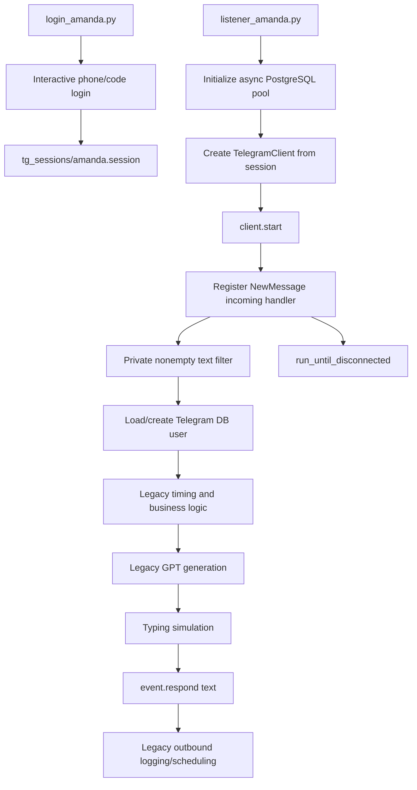
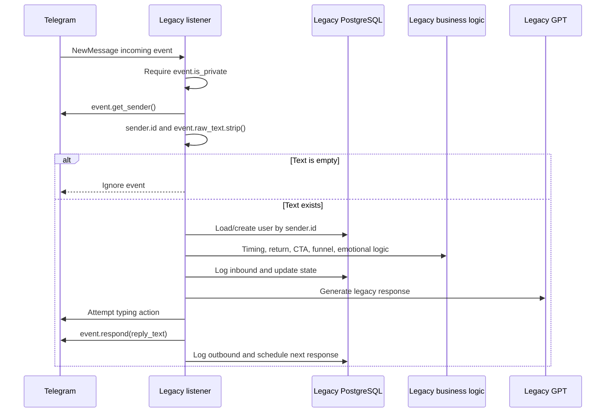
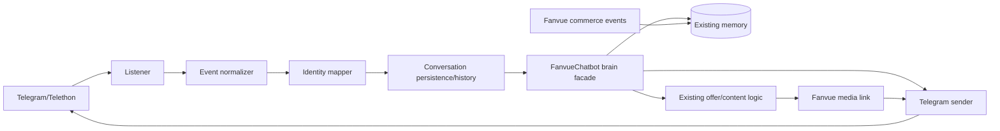

# Telegram Reference Repository Audit

## 1. Executive Summary

The `C:\Telegram Chatbot` repository is a compact legacy Telethon application consisting of eight tracked Python modules, a `.gitignore`, an ignored `.env`, and an ignored Python 3.11 virtual environment under `bot/`. It demonstrates the basic shape of a Telegram user-session integration: one-time MTProto login, a persisted `.session` file, an asynchronous private-message listener, numeric Telegram user identification, text replies to the originating peer, and a long-running disconnect wait.

Only those Telegram transport concepts are candidates for recreation inside FanvueChatbot. No source file should be imported, and the repository must not become a package, runtime dependency, or second application beside FanvueChatbot.

The reusable reference patterns are:

- `TelegramClient` session-based authentication.
- A one-time interactive login separated from the long-running listener.
- `events.NewMessage(incoming=True)` event registration.
- Private-chat and nonempty-text filtering.
- `sender.id` as a stable Telegram user identifier.
- Replying to the event's peer with `event.respond()` or an equivalent sender call.
- Waiting on `run_until_disconnected()`.
- Keeping session files and secrets out of Git.

The repository is not directly reusable. Its current listener cannot import successfully because `listener_amanda.py` requests `TG_API_ID` and `TG_API_HASH` from `config.py`, but `config.py` does not define them. It also invokes `TelegramClient.send_chat_action()`, which is not present in the installed Telethon 1.43 client; the installed API exposes `action()`, `send_message()`, and `send_file()`. Authentication is internally ambiguous because bot tokens are mandatory in configuration but the operational flow uses a phone-authorized user session and never passes a bot token.

No media delivery is implemented. Media-only inbound messages are discarded because the listener requires nonempty `event.raw_text`; there are no calls to `send_file`, photo/video APIs, media download, attachment inspection, albums, or progress callbacks.

Most of the repository is application-level intelligence that must be rejected: its PostgreSQL user state, emotional engine, heat and sexual-momentum scoring, funnel stages, CTA thresholds and cooldowns, country tiers, timing/sleep/daily-limit rules, GPT prompts, Grok classifiers, persona rules, conversion inference, and post-CTA lifecycle all overlap with the preserved FanvueChatbot brain.

The recommended result is a small `app/integrations/telegram/` transport package inside FanvueChatbot. It should normalize Telegram events, resolve Telegram identities to the existing internal/Fanvue commerce identity, invoke the existing DecisionEngine, send text or Fanvue media links, record delivery outcomes, and contain no sales or conversational intelligence.

## 2. Telegram Architecture Overview

### 2.1 Audited repository inventory

| Path | Role | Audit disposition |
|---|---|---|
| `login_amanda.py` | One-time Telethon user-session login | Reference authentication/session lifecycle |
| `listener_amanda.py` | Async DM listener, orchestration, typing, text send | Extract transport concepts only |
| `config.py` | Environment loading for Telegram, LLM, database, links, personas | Rewrite narrowly in FanvueChatbot configuration |
| `database.py` | Async PostgreSQL pool and legacy user/funnel/message state | Do not migrate |
| `logic.py` | Emotional, funnel, CTA, heat, momentum, classifier logic | Do not migrate |
| `timing.py` | Reply pacing, sleep windows, funnel delays, timing gates | Do not migrate |
| `gpt.py` | Persona prompt, CTA injection, GPT response generation | Do not migrate |
| `grok.py` | Sentiment and sexual-intensity classifiers | Do not migrate |
| `.gitignore` | Ignores `.env`, `bot/`, caches, and `tg_sessions/` | Retain the principle, not necessarily the exact file |
| `.env` | Local credentials and account configuration | Values not reviewed or copied; names indicate mixed concerns |
| `bot/` | Python 3.11.7 virtual environment, not application code | Ignore as source; recreate dependencies in FanvueChatbot environment |

The tracked repository contains no schema migrations, tests, README, deployment configuration, process supervisor, media assets, Telegram session file, or Telegram account-management abstraction. The ignored environment includes Telethon 1.43.0, OpenAI 2.31.0, psycopg 3.3.3, and psycopg-pool 3.3.0.

### 2.2 Current runtime architecture



### 2.3 Architectural assessment

The listener is a monolithic event handler. Telegram transport, identity persistence, business rules, model calls, delays, state mutation, delivery, and scheduling are interleaved. That structure is unsuitable for FanvueChatbot because the target architecture needs Telegram to end at a transport adapter boundary before the existing intelligence pipeline begins.

The usable architectural idea is the outer lifecycle:

```text
authenticate session
  -> connect client
  -> subscribe to incoming private messages
  -> normalize Telegram event
  -> invoke application
  -> send application response
  -> remain connected
```

Everything between normalization and sending must come from FanvueChatbot, not the reference application.

## 3. Authentication Analysis

### 3.1 Mechanism in the reference repository

The active mechanism is Telethon MTProto user-account authentication:

1. `login_amanda.py` loads `TG_API_ID` and `TG_API_HASH` directly from `.env`.
2. It creates the relative directory `tg_sessions/` if missing.
3. It constructs `TelegramClient("tg_sessions/amanda", API_ID, API_HASH)`.
4. `await client.start()` performs Telethon's interactive authorization flow. In this use, it prompts for a phone number and login code and may require the account's two-step-verification password.
5. Telethon persists authorization as `tg_sessions/amanda.session`.
6. The login script explicitly disconnects.
7. The listener later constructs a client with the same session name and starts it without repeating interactive authorization while that session remains valid.

This is a user session, not a bot-token session. Although `config.py` requires `TELEGRAM_BOT_TOKEN_AVA` and `TELEGRAM_BOT_TOKEN_AMANDA`, neither token is passed to `client.start(bot_token=...)` or used elsewhere. The `.env` also contains Telegram chat-ID names, but the source does not consume them.

### 3.2 Session storage

- Session location is relative to the process working directory: `tg_sessions/amanda.session`.
- `tg_sessions/` and `*.session`-containing directory state are effectively excluded through `.gitignore`'s `tg_sessions/` rule.
- No session file was present during the audit.
- No encryption-at-rest, permission hardening, external secret store, rotation, backup, revocation, lock ownership, or multi-instance policy is implemented.
- A Telethon session is a bearer credential with account-level access and must be protected more strongly than ordinary application state.

### 3.3 Credential requirements

For the implemented user-session pattern:

- Telegram API ID.
- Telegram API hash.
- Phone number and login code during initial authorization.
- Two-step-verification password if enabled.
- Persistent access to the authorized session file afterward.

Bot tokens are not required by the implemented flow despite being mandatory in `config.py`. The target project must choose one authentication model explicitly rather than configuring both accidentally.

### 3.4 What to reuse conceptually

- Separate one-time authorization from normal listener startup.
- Use a stable, persona/account-scoped session name.
- Persist the Telethon session outside source control.
- Validate required credentials before connecting.
- Explicitly disconnect a one-time authorization client.

### 3.5 What to rewrite

- Centralize Telegram settings in FanvueChatbot's configuration system.
- Choose user-account MTProto or bot-token authentication deliberately.
- Use deterministic absolute session paths or an approved session backend.
- Model multiple Telegram accounts/personas without hard-coded `amanda` paths.
- Add startup validation that matches the chosen authentication type.
- Add secure session permissions, ownership, rotation/revocation guidance, and single-instance or locking behavior.
- Add structured shutdown and disconnect handling for the long-running listener.

### 3.6 Authentication risks

| Risk | Severity | Finding |
|---|---|---|
| User/bot model ambiguity | High | Bot tokens are required by config but never used; runtime uses a user session |
| Broken config contract | High | Listener imports `TG_API_ID`/`TG_API_HASH` from `config.py`, which does not define them |
| Session credential theft | Critical | An unprotected `.session` can authorize account access |
| Relative session path | Medium | Working-directory changes can create or select the wrong session |
| Multi-instance collision | High | No rule prevents two processes from using the same session/database file |
| Interactive recovery | Medium | Expired/revoked sessions may require unattended-service intervention |
| Account policy/operations | High | User-account automation requires explicit policy, ownership, and operational review |
| Persona crossover | High | Hard-coded Amanda session does not establish safe multi-persona separation |

## 4. Listener Analysis

### 4.1 Registration and lifecycle

`listener_amanda.py`:

- Sets `WindowsSelectorEventLoopPolicy` on Windows.
- Initializes the async PostgreSQL pool before Telegram.
- Constructs `TelegramClient(SESSION_NAME, TG_API_ID, TG_API_HASH)`.
- Calls `await client.start()`.
- Registers a nested handler with `@client.on(events.NewMessage(incoming=True))`.
- Finishes startup with `await client.run_until_disconnected()`.

Telethon can reconnect at its client layer, but the repository contains no explicit reconnection policy, retry budget, connection-state telemetry, catch/restart loop, session-revocation handling, or graceful service shutdown around the listener.

### 4.2 Incoming message lifecycle



### 4.3 Message filtering

Implemented filters:

- `incoming=True` excludes outgoing events from this handler.
- `event.is_private` excludes groups, channels, and other non-private contexts.
- `event.raw_text.strip()` excludes messages without text.

Missing filters and normalization:

- No explicit sender-null/deleted-user handling.
- No bot/service-account exclusion.
- No message-ID capture or deduplication.
- No edit, deletion, forwarded-message, reply-context, command, album, or media handling.
- No account/persona identifier included in the normalized identity.
- No message timestamp normalization.
- No maximum length, encoding, or unsupported-content policy.
- No per-user concurrency control.
- No ordering guarantee when multiple handler tasks are active.
- No allowlist/QA enforcement despite related environment fields.

### 4.4 Useful listener patterns

- Register a narrowly scoped incoming-message event.
- Filter private conversations at the transport edge.
- Obtain the sender entity asynchronously.
- Read text from the Telegram event without scraping UI state.
- Keep the client alive with a disconnect wait.
- Apply a Windows event-loop policy only if the deployed runtime actually requires it.

These should be recreated behind a clean listener interface; the legacy handler body should not be copied.

### 4.5 Listener risks

| Risk | Severity | Impact |
|---|---|---|
| Non-runnable imports | High | Listener cannot import Telegram API credentials from current config |
| Blocking per-event sleeps | High | Warmup/typing/timing sleeps hold handler tasks and invite overlap |
| Concurrent state races | High | Multiple messages can read and mutate stale user state concurrently |
| No deduplication | High | Reprocessed events can double-increment state and produce duplicate offers |
| Media blindness | High | Media-only messages are silently discarded |
| No event/message IDs | High | Delivery correlation, idempotency, and threading cannot be audited |
| PII logging | Medium-high | Raw usernames and message text are printed to stdout |
| No graceful shutdown | Medium | Listener does not close its DB pool or explicitly disconnect in `finally` |
| Error isolation | Medium-high | Only sending is locally caught; earlier handler failures can be unstructured |

## 5. Identity Analysis

### 5.1 Identifiers used

| Identifier | Current use | Stability |
|---|---|---|
| `sender.id` | Stored as `telegram_id`; primary legacy user key; also passed as private chat target | Stable for the Telegram account |
| `sender.username` | Display/debug/GPT parameter; stored in users table | Unstable, optional, mutable |
| `sender.first_name`, `sender.last_name` | Stored profile metadata | Unstable, optional, mutable |
| `sender.language_code` | Inferred country/tier in loader | Weak/optional and not reliable commerce identity |
| `event.raw_text` | Inbound content | Content, not identity |
| `event.chat_id` | Not captured | Should be captured as conversation/peer identifier |
| `event.id` or `event.message.id` | Not captured | Should be captured for deduplication/correlation |
| Telegram account/session identity | Hard-coded implicitly as Amanda | Must become an explicit tenant/persona identifier |

In a one-to-one private Telegram conversation, the sender ID and peer/chat ID are often numerically aligned, which is why the legacy code can pass `sender.id` as the typing/send target. They are still different semantic fields and should be stored separately. This distinction becomes mandatory for groups, channels, forwarded contexts, migrations, and clearer auditing even if the first target supports DMs only.

### 5.2 Legacy database identity

`database.py` uses `telegram_id` as the sole user lookup key. Existing users are returned without refreshing changed username/name metadata. The source does not include creator account/persona in that key, so the same Telegram user interacting with multiple managed Telegram accounts would collide in one legacy `users` row.

The database module assumes pre-existing `users`, `messages`, and `events` tables. No DDL or migration is present. `messages` stores Telegram user ID, direction, text, timestamp, and bot name, but not Telegram message ID or chat ID. `events` stores only Telegram user ID, type, and timestamp.

### 5.3 Recommended identifiers for migration

Use a composite external identity, not username:

```text
platform = telegram
telegram_account_id = the managed Telegram account/persona receiving the DM
telegram_user_id = sender.id
telegram_chat_id = event.chat_id
telegram_message_id = event.id/message.id
```

Map that external identity to:

```text
internal_creator/account
internal_user
existing Fanvue commerce user UUID when linked
existing DecisionEngine memory owner
```

Recommended rules:

- Treat numeric Telegram user ID as the stable user-side external identifier.
- Treat chat ID as the stable conversation peer identifier.
- Treat message ID together with account/chat scope as the idempotency key.
- Store username and names as refreshable metadata only.
- Include managed Telegram account/persona in all uniqueness constraints.
- Never join Telegram to Fanvue by username alone.
- Ensure Fanvue link/purchase attribution resolves back to the same internal user.

## 6. Message Delivery Analysis

### 6.1 Existing text delivery

The listener sends text with:

```text
await event.respond(reply_text)
```

This sends a response to the peer associated with the incoming event. The returned Telegram message object is ignored. The implementation does not store Telegram's outbound message ID, delivery timestamp, peer ID, or response metadata.

`event.respond()` is peer-context convenience, not an explicit reply-to-thread operation. The code does not pass `reply_to`, buttons, entities, link-preview controls, parse mode, silent delivery, schedule time, or formatting metadata.

### 6.2 Typing indicator

The helper computes a randomized “thinking” delay and a length/mood-based typing duration. During that duration it calls `client.send_chat_action(chat_id, "typing")` every 0.7 seconds and silently ignores all exceptions.

The timing behavior is business/presentation logic and should not be copied. More importantly, the installed Telethon 1.43 `TelegramClient` does not expose `send_chat_action`; it exposes `action()`. The legacy typing implementation therefore cannot be treated as a valid API example.

The reusable requirement is only: the sender may expose a bounded, cancellable typing action before sending when allowed by application policy.

### 6.3 Formatting and links

- Responses are plain generated strings.
- CTA URLs may be embedded directly into GPT output.
- No explicit parse mode is set.
- No escaping or Telegram entity handling is implemented.
- No message-length splitting or link-preview policy is implemented.
- No structured button or deep-link delivery exists.

For the target migration, Fanvue media links should be supplied by the preserved FanvueChatbot offer engine and sent by the Telegram sender. Link formatting must remain a transport concern; offer eligibility and link selection must remain brain/commerce concerns.

### 6.4 Error handling

The text-send block catches a general exception, prints it, and abandons all outbound logging/scheduling. There is no classification for flood waits, RPC errors, transient connectivity, unauthorized sessions, blocked users, deactivated accounts, invalid peers, oversized messages, or permanent failures. There is no retry, backoff, dead-letter state, or delivery reconciliation.

Typing exceptions are completely swallowed, which avoids blocking text delivery but also hides API breakage—as seen with the nonexistent method.

### 6.5 Recommended delivery behavior

- Accept an explicit Telegram account/session and chat target rather than relying only on the inbound event object.
- Return and persist the outbound Telegram message ID and timestamps.
- Separate generated, queued, attempted, delivered/accepted, retryable failure, and permanent failure states.
- Apply existing FanvueChatbot global send/execution guards before calling Telegram.
- Handle Telegram-specific flood-wait and RPC errors explicitly.
- Use bounded retries with idempotency protection; never regenerate the DecisionEngine response on a transport-only retry.
- Escape/format messages deliberately and split messages at Telegram limits.
- Set link-preview behavior explicitly for Fanvue media links.
- Make typing optional, bounded, cancellable, and nonfatal.

## 7. Media Analysis

### 7.1 Existing capabilities

No Telegram media functionality is implemented in repository-owned source:

- No `send_file()` call.
- No photo, video, document, voice, audio, animation, sticker, or album send.
- No media download or upload.
- No `event.media` inspection.
- No file metadata, MIME type, caption, thumbnail, progress callback, or size-limit handling.
- No media-reference cache.
- No test or sample media.

Telethon 1.43 in the ignored virtual environment exposes `send_file`, so the library is capable of media delivery; the application does not exercise it.

### 7.2 Inbound media behavior

The listener computes `incoming_text = event.raw_text.strip()` and returns when it is empty. Consequently, a photo/video/file without a caption is silently ignored. A media message with a caption is treated only as text; its attachment is not inspected or persisted.

### 7.3 Target media requirements

The migration objective prioritizes Fanvue media links for monetization:

```text
FanvueChatbot offer decision
  -> Fanvue-hosted media/checkout link
  -> Telegram text/link delivery
  -> Fanvue purchase/unlock event
  -> existing buyer/ownership memory update
```

This does not require copying paid media into Telegram. Direct Telegram media delivery, if later authorized, should be a separate capability with:

- File/path/bytes/reference input normalization.
- Photo versus video versus document selection.
- Caption and entity/format handling.
- Size and MIME validation.
- Upload timeouts and progress behavior.
- Album/grouped-media handling if required.
- Telegram file-ID/reference persistence for reuse.
- Safety/content-delivery guards.
- Clear free-versus-monetized access rules.
- No bypass of Fanvue checkout or ownership controls.

### 7.4 Media recommendation

For the first migration stage, implement only reliable Fanvue-link delivery through Telegram unless a separate requirement explicitly calls for direct free media. Do not infer direct Telegram media delivery from the reference repository; it contains no implementation to validate.

## 8. Business Logic Rejection List

All items below are marked **DO NOT MIGRATE** because FanvueChatbot already owns the corresponding intelligence or because the behavior is legacy application policy rather than Telegram transport.

| Legacy area | Files/functions | Reason for rejection |
|---|---|---|
| Legacy user memory/state | `database.py` `users` fields and state helpers | Would fragment existing FanvueChatbot memory and user profiles |
| Legacy message/event database | `database.py` `messages` and `events` helpers | Missing target IDs and duplicates existing repositories |
| Country monetization tiers | `determine_country_tier()` | Business/value policy belongs to FanvueChatbot buyer intelligence |
| Emotional engine | `load_emotional_state`, `apply_emotional_shift` | Duplicates preserved emotional and relationship services |
| Sexual momentum | intensity weights, decay, momentum updates | Duplicates intent/intimacy/engagement intelligence |
| Funnel stages | `evolve_funnel_stage`, stages 0–6 | Competes with DecisionEngine routes, modes, offers, and buyer sessions |
| Heat scoring | `calculate_heat_score`, streak bonus | Duplicates engagement and intent scoring |
| CTA thresholds | `should_trigger_cta`, counters, cooldowns | Existing offer/timing/gating systems own monetization decisions |
| CTA links | `build_cta_link`, DMGate URLs | Target commerce link must come from Fanvue content/offer logic |
| Dead/quiet/HP modes | HP3, HP6, HP13, HP14, HP16 flags | Legacy behavioral state unrelated to Telegram transport |
| Soft redirects | activation/count/expiry helpers | Legacy conversion policy; not transport |
| Post-CTA conversion inference | inferred conversion, dormant stages | Fanvue purchases/unlocks are the authoritative commerce feedback |
| Ghost-return/long-haul logic | return detection and flags | Existing continuity, outreach, and relationship systems own this behavior |
| Daily reply limits | country-tier reply limits | Application policy, and currently disabled by unconditional return |
| Sleep/busy windows | `timing.py` time gates | Existing timing/engagement policy must remain authoritative |
| Funnel/emotional delays | `funnel_delay`, `emotional_delay_modifier` | Duplicates FanvueChatbot timing and behavior logic |
| Random warmup/icebreaker pacing | listener and `timing.py` | Business presentation behavior, not Telegram transport |
| GPT personas/prompts | `gpt.py` | Duplicates personas, creator profiles, prompt systems, and safety behavior |
| GPT CTA injection | `compute_cta_allowed`, prompt link injection | Existing DecisionEngine/OfferService must decide links |
| GPT sanitizers/fallbacks | HP13/HP16 and generic fallback reply | Legacy behavior bypasses current response validation/continuity |
| Grok sentiment/intensity | `grok.py` and duplicated classifiers in `logic.py` | Duplicates current intent, objection, intimacy, and provider orchestration |
| AI-deflection rules | `build_persona_prompt` | Persona/safety policy must remain in FanvueChatbot |
| QA override | `QA_MODE` forcing explicit/CTA state | Dangerous legacy business bypass, not a transport test mechanism |
| Persona tone dictionary | `AI_TONE` in config | Existing creator-profile and persona systems are authoritative |

### 8.1 Telegram database classification

| Component | Classification | Rationale |
|---|---|---|
| Async pool pattern | **REPLACE** | FanvueChatbot already has its database layer; do not introduce a second pool/schema implicitly |
| `users` table/state | **IGNORE** | Legacy funnel memory must not be imported |
| `messages` table | **REPLACE** | Preserve message-history behavior using target repositories with account/chat/message IDs |
| `events` table | **REPLACE** | Use a target transport-event/idempotency record if needed |
| `telegram_id` as external key concept | **REUSE** | Map numeric Telegram ID through a new identity bridge, not the old table |
| Username/name metadata | **REUSE as metadata only** | Refreshable labels, never identity keys |
| Dynamic `update_field` helper | **IGNORE** | Broad column mutation by name is coupled to undocumented legacy schema |
| CTA/funnel/timing columns | **IGNORE** | Overlapping intelligence state |
| Inbound/outbound direction concept | **REUSE** | Already compatible with FanvueChatbot conversation semantics |

## 9. Telegram Adapter Recommendations

### 9.1 Proposed package

```text
app/integrations/telegram/
├── __init__.py
├── config.py
├── client_manager.py
├── listener.py
├── event_normalizer.py
├── identity_mapper.py
├── sender.py
├── media_service.py
├── delivery_errors.py
└── models.py
```

These are recommended responsibilities, not files created by this audit.

| Recommended module | Responsibility | Must not contain |
|---|---|---|
| `config.py` | Chosen auth mode, API credentials, session location, account/persona mapping | LLM, offer, CTA, or buyer settings |
| `client_manager.py` | Client construction, session lifecycle, connect/disconnect/reconnect, health | Conversation logic |
| `listener.py` | Register Telegram events, filter supported messages, invoke application facade | GPT calls, memory rules, sales rules |
| `event_normalizer.py` | Produce transport-neutral envelope from Telethon event | Database business-state mutations |
| `identity_mapper.py` | Map Telegram account/user/chat to existing internal and Fanvue commerce identity | Username-based identity guesses |
| `sender.py` | Text/link send, formatting, typing, delivery results, Telegram errors/retries | Offer eligibility or response generation |
| `media_service.py` | Optional direct media primitives and Telegram reference persistence | Fanvue ownership bypass or content selection |
| `delivery_errors.py` | Classify transient/permanent Telegram failures | Generic swallowing of exceptions |
| `models.py` | Typed inbound/outbound envelopes and delivery results | ORM duplication of legacy Telegram schema |

An alternative naming scheme such as `telegram_adapter.py`, `telegram_listener.py`, `telegram_sender.py`, `telegram_user_mapper.py`, and `telegram_media_service.py` is acceptable. Separation of responsibilities matters more than filenames. A single `telegram_adapter.py` should not recreate the legacy monolith.

### 9.2 Minimum feature set

The minimum transport feature set is:

1. **Authentication:** one explicitly chosen Telethon authorization model.
2. **Session management:** secure, account-scoped persistence and startup validation.
3. **Listener:** incoming private-message subscription and supported-content filtering.
4. **Normalization:** account ID, user ID, chat ID, message ID, text, timestamp, media metadata.
5. **Identity mapping:** Telegram external identity to existing internal user/memory and Fanvue commerce identity.
6. **Message send:** text and Fanvue-link delivery with explicit formatting/preview policy.
7. **Typing actions:** optional and nonfatal through a supported Telethon API.
8. **Media send:** capability boundary only; direct media can be deferred if links satisfy scope.
9. **Disconnect handling:** graceful shutdown and cleanup.
10. **Reconnect handling:** bounded connection recovery and health reporting.
11. **Error handling:** Telegram-specific classification, backoff, and delivery-state persistence.
12. **Idempotency/order:** deduplicate and serialize processing per account/chat.

### 9.3 Target interaction boundary



The adapter should receive a completed response/offer decision from FanvueChatbot. It should never independently score heat, choose CTA timing, call an LLM, infer conversion, or maintain a second relationship state.

## 10. Migration Guidance

### 10.1 Recommended sequence

1. **Choose Telegram account model.** Decide user session versus bot token based on required capabilities and operational policy. Do not carry both configurations without purpose.
2. **Define the identity contract.** Establish Telegram account, user, chat, and message identifiers and their mapping to existing internal/Fanvue commerce users.
3. **Define normalized envelopes.** Specify inbound message and outbound delivery-result structures before listener work.
4. **Establish a brain facade.** Route normalized messages to the existing `DecisionEngine.process_message()` path with recent history and the existing memory key.
5. **Recreate authentication/session management.** Use the reference login lifecycle concept, not its hard-coded files.
6. **Recreate the listener shell.** Subscribe, filter, normalize, deduplicate, persist, map, and call the brain.
7. **Add the sender.** Send the exact generated response and optional Fanvue link; record Telegram result identifiers.
8. **Preserve Fanvue commerce webhooks.** Purchases, unlocks, tips, subscriptions, ownership, and buyer-memory updates remain Fanvue-backed.
9. **Add resilience.** Per-chat serialization, reconnect handling, flood waits, transport-only retries, shutdown, and health checks.
10. **Validate in shadow mode.** Compare DecisionEngine decisions and memory mutations before enabling Telegram sends.

### 10.2 Do not copy checklist

- Do not copy `database.py` or its schema assumptions.
- Do not copy `logic.py`, `timing.py`, `gpt.py`, or `grok.py`.
- Do not import the reference repository by path.
- Do not reuse its `.env` or session file.
- Do not treat username as identity.
- Do not call the DecisionEngine more than once for a transport retry.
- Do not allow direct Telegram media to bypass Fanvue commerce controls.
- Do not remove Fanvue monetization webhooks while replacing Fanvue chat webhooks.
- Do not record a successful outbound delivery before Telegram acknowledges it.
- Do not silently swallow Telegram exceptions.

### 10.3 Verification requirements

- Authentication restart and revoked-session tests.
- Multiple managed Telegram account/persona isolation tests.
- Duplicate, edited, media-only, out-of-order, and concurrent-message tests.
- Stable identity and mutable-username tests.
- Telegram-to-Fanvue purchase attribution tests.
- Text length, formatting, link preview, blocked-user, flood-wait, and reconnect tests.
- Delivery-state reconciliation tests.
- Regression tests proving unchanged FanvueChatbot memory, relationship, buyer, offer, and response behavior.

### 10.4 Final disposition

The reference repository is valuable as a narrow transport reconnaissance artifact. Its useful content is approximately the outer Telethon lifecycle and identifier access pattern, not its application architecture. The migration should recreate those mechanics inside FanvueChatbot and discard every overlapping intelligence system.

This audit was static and analysis-only. No application code was modified, no functionality was created, no Telegram implementation was added, and the repositories were not merged. The only new file is this requested report.
